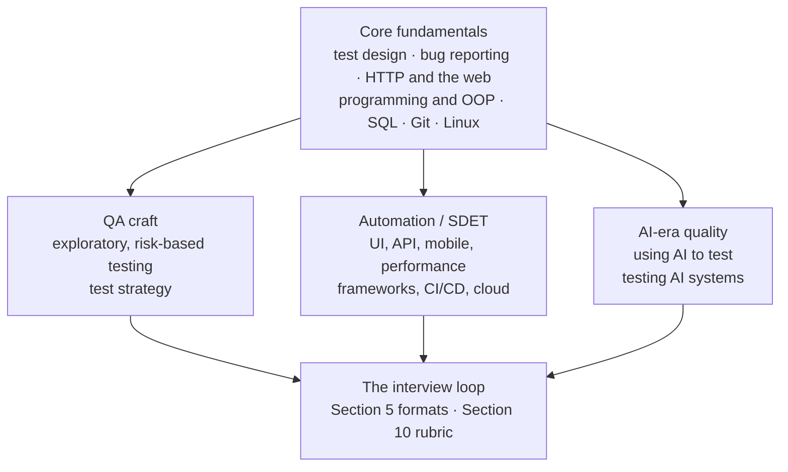
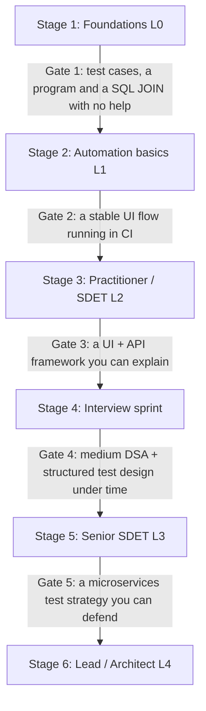
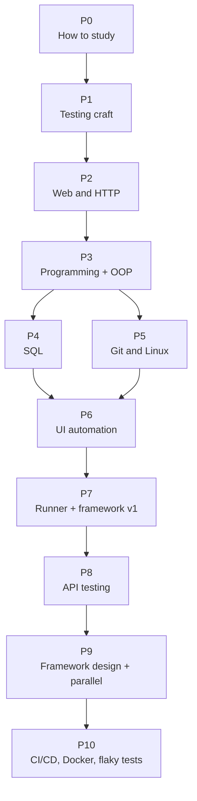
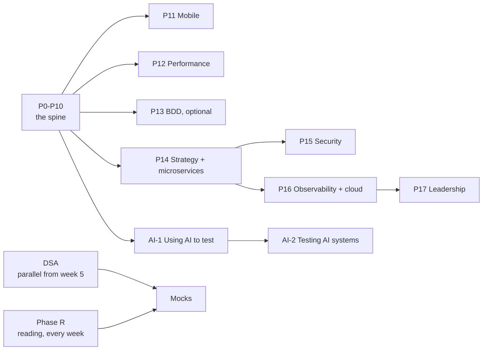

# QAVerse: Manual Testing, Automation, SDET & AI-era Quality Engineering

**One roadmap from your first test case to QA Architect.** It works for complete beginners (L0) and goes all the way to Lead / Principal / QA Architect (L4). It covers manual testing, programming, UI / API / mobile / performance automation, framework design, CI/CD, cloud, and the AI layer that 2026 interviews now ask about: **using AI to test**, and **testing AI systems**.

This README is a **living tracker**, not a textbook. Use it to decide what to learn next, pick practice problems at your level, and score your mock interviews. The deep material lives in the books, official docs and the [`api_testing/`](api_testing/README.md) module linked below.

> **Last reviewed:** October 2026. Tool versions, market numbers and interview patterns change fast. Every dated fact lives in [Section 12](#12-verified-current-state-as-of-october-2026) with its source and date, so you can judge how fresh it is.

---

## Start here

Do not read this file from top to bottom. It is a **menu with a placement test in front of it**. Do these five things, in this order, and you will always know what to do next.

**Step 1: Place yourself (15 minutes).** Answer the six gate questions in [Section 2.0](#20-find-your-starting-stage). The first *no* is your stage. Your job title does not decide your stage. Your answers do.

**Step 2: Pick one stack (5 minutes).** Java + Selenium, Python + Selenium, or JS/TS + Playwright. [Section 3](#3-choose-your-stack-variant) helps you choose. Stay with it until you reach L2.

**Step 3: Open your stage card and your calendar.** Each stage card in 2.0 tells you the learning order, what "done" looks like, and how many hours it takes. Each calendar (2.1 to 2.6) turns that into weeks.

**Step 4: Every week, follow the same rhythm** ([Section 2.8](#28-the-weekly-rhythm-what-1215-hours-looks-like-next-to-a-job)): learn the topic your calendar names ([Section 4](#4-phase-by-phase-syllabus)), build something, do DSA practice from week 5, read one article, and from the week your stage says, do one timed mock scored with [Section 10](#10-mock-scoring-rubric-15).

**Step 5: Track and move up.** Log your weak spots and your real hours in the [Section 11 tracker](#11-progress-tracker). When you can pass your stage's gate, move to the next stage. If you cannot, the tracker shows which phase to revisit.

### The whole journey on one page

| Stage | You are | Calendar | Pace | Core phases, in order | Gate to leave |
|---|---|---|---|---|---|
| **1 Foundations (L0)** | Complete beginner, or manual tester with no coding | 2.1 | 10 wk @ 12–15 h | P0 → P1 → P2 → P3 → P4 → P5, DSA from week 5 | Clear test cases, a small program and a SQL JOIN with no help |
| **2 Automation basics (L1)** | Can test manually, starting automation | 2.2 | 10 wk @ 12–15 h | P6 → P7 → first CI run (P10 basics) → AI-1 basics | A 5-step UI flow automated, stable, running in CI |
| **3 Practitioner / SDET (L2)** | Junior automation engineer | 2.3 | 16 wk @ 12–15 h | P8 → P9 → P10 → P11 → P12 → (P13) | A UI + API framework you built and can explain in 4 minutes |
| **4 Interview sprint** | Ready to apply for SDET-1 / SDET-2 roles | 2.4 | 10 wk @ 12–15 h | DSA to medium → LLD → test-design rounds → AI-1 at L2 → mocks | Medium DSA in 30 min + a structured "how would you test X?" |
| **5 Senior SDET (L3)** | 5+ years, or aiming for Senior SDET | 2.5 | 24 wk @ 8–10 h | P14 → P15 → P16 → AI-2 → metrics | A microservices test strategy you can defend |
| **6 Lead / Architect (L4)** | 8+ years, aiming for Lead / Principal / QA Architect | 2.6 | 8–12 wk @ 6–8 h | P17: strategy, ROI, governance, team design | A written quality strategy that survives a tough panel |

**DSA practice, Phase R (reading) and mocks run alongside every stage.** They are habits, not phases you "finish".

Stages 1–4 add up to about **46 weeks (~10–11 months)** from zero to your first SDET interview at 12–15 hours a week. [Section 2.10](#210-fast-track-plans-for-experienced-people) has shorter plans if you already have experience.

### Where everything is

| Section | Open it when |
|---|---|
| [0 How to use this README](#0-how-to-use-this-readme) | Once, before week 1 |
| [1 What this roadmap covers](#1-what-this-roadmap-covers) | You think your prep has a gap |
| **[2 Stages, gates and calendars](#2-stages-gates-and-calendars)** | **Week 1, and every time you finish a stage** |
| [3 Choose your stack variant](#3-choose-your-stack-variant) | Before week 1, and when you add a second stack at L2+ |
| **[4 Phase-by-phase syllabus](#4-phase-by-phase-syllabus)** | **Every week. This is the actual work** |
| [5 Interview round formats and time budgets](#5-interview-round-formats-and-time-budgets) | Before every mock |
| [6 Test-design scenario list](#6-test-design-scenario-list-by-level) | Picking this week's "how would you test X?" practice |
| [7 Coding and LLD problem list](#7-coding-and-lld-problem-list) | Picking this week's coding or design build |
| [8 Common mistakes](#8-common-mistakes-and-why-experienced-testers-fail) | Reviewing a mock that went badly |
| [9 Level signals](#9-level-signals-l0-to-l4) | Checking whether your answers sound like your target level |
| [10 Mock scoring rubric](#10-mock-scoring-rubric-15) | Scoring every mock |
| [11 Progress tracker](#11-progress-tracker) | End of every week |
| [12 Verified current state](#12-verified-current-state-as-of-october-2026) | Before you quote a version, a tool feature or a statistic in an interview |
| [13 Resource index](#13-resource-index) | Looking for books, docs, practice sites or communities |
| [14 Repository map](#14-repository-map) | Looking for notes, PDFs and mind maps in this repo |
| [15 Keeping this README current](#15-keeping-this-readme-current) | Editing this README |

---

## 0. How to use this README

- Copy the **Progress Tracker** ([Section 11](#11-progress-tracker)) into your own notes or fork, and update it every week.
- Every topic in Section 4 has a tag, so you know how long it will stay useful:
  - 🟦 **Fundamental**: test design, HTTP, OOP, SQL, waits and synchronisation. Will not go out of date.
  - 🟩 **Current practice**: today's common approach (for example Page Object Model, Docker-based grids). Can change over a few years.
  - 🟨 **Tool / vendor**: specific to one product (BrowserStack, AWS Device Farm, Allure). Learn it if your target company uses it.
  - 🟧 **Emerging**: know it exists (for example Playwright Test Agents, MCP). Go deep only if your role needs it.
- **Never spend more than two weeks only reading.** Build something every week. Testing is a hands-on skill, and interviews check hands-on skill.
- **Try it yourself before you look at anyone's answer.** Write your own test cases first, then compare. Memorised answers fail the first follow-up question.
- **Judge your level by what you can do, not by years.** Many 8-year testers work at L1, and some 3-year engineers work at L3.

### Words you will see

| Word | Simple meaning |
|---|---|
| **QA** | Quality Assurance. Making sure software works the way users need it to |
| **SDET** | Software Development Engineer in Test. A tester who writes code: frameworks, automated tests, CI pipelines |
| **Manual testing** | A person checks the software by hand, following test cases or exploring |
| **Automation** | Code that runs the checks for you, again and again |
| **Framework** | The structure around your automated tests: folders, helpers, config, reports |
| **CI/CD** | Continuous Integration / Continuous Delivery. Tests run automatically every time code changes |
| **DSA** | Data Structures and Algorithms. The coding-round questions (arrays, strings, maps, trees) |
| **LLD** | Low-Level Design. Designing classes and how they work together |
| **Flaky test** | A test that sometimes passes and sometimes fails with no code change |
| **Mock interview** | A practice interview, timed, ideally with another person |
| **Gate** | A check question at the end of a stage. Pass it to move up |

### What is actually in this repo

| Path | State |
|---|---|
| `README.md` | **The roadmap.** Everything about the plan is here |
| [`api_testing/`](api_testing/README.md) | **Available.** A full API testing roadmap (manual → automation → advanced), Postman notes, interview Q&A PDFs and mind maps |
| Other modules | **Planned.** See [Section 14](#14-repository-map) |

There are no worked solutions to the practice problems here, on purpose. This file tells you what to do and links to depth. Write your own answers first.

### Three tracks, one core

The testing fundamentals are not something you finish and leave behind. Every track keeps using them.



### What interviewers grade (all levels)

Across candidate write-ups and company loops ([sources in Section 12](#12-verified-current-state-as-of-october-2026)), SDET interviews keep checking the same five things:

1. **Test thinking**: do you ask clarifying questions, think about risk, and cover positive, negative, edge and non-functional cases in a structured way?
2. **Coding**: can you write clean, working code without IDE help, and test your own solution?
3. **Automation depth**: can you explain *why* you chose a locator, a wait, a pattern, or a test layer?
4. **Engineering ownership**: CI/CD, parallel runs, flaky tests, reporting, Docker. Do you own the pipeline or only the scripts?
5. **Communication**: can you walk through your framework in 3–4 minutes, and explain a trade-off without declaring a "winner"?

**What changed recently:** AI fluency is now a common interview topic from L2 upwards. Interviewers reward people who can explain **where AI helps and where it fails** (for example, AI-generated tests that assert buggy behaviour). At senior levels, test *strategy* and *metrics* questions fail more candidates than syntax questions do.

---

## 1. What this roadmap covers

A roadmap is only useful if you know what it promises. This one promises **an order to learn things in, and coverage** across three tracks and six stages, with every dated claim traceable to a source. It does not replace books, courses or real project work.

### Non-negotiables

These hold at every level. Nothing in Section 4 is allowed to push them out:

- **Test design comes first.** Equivalence partitioning, boundary values, decision tables and state transitions are tested in every interview, from L0 to L4
- **Build, don't only read.** Every stage ends with a milestone you push to GitHub
- **DSA practice in parallel from week 5.** SDET roles are hired against a software-engineering bar
- **One stack deep before a second one shallow**
- **Verify every AI output.** Never commit a test you do not understand
- **Fundamentals (🟦) stay first.** Emerging material (🟧) is added at the edges and never replaces them
- **Reading real-world testing write-ups every week** (Phase R). Books teach techniques; real write-ups show what teams actually chose and what broke

### Coverage map

| Area | Covered in |
|---|---|
| Manual testing craft (SDLC/STLC, test design, bug lifecycle, exploratory) | P1, Section 6 |
| Web and HTTP basics, DevTools | P2 |
| Programming + OOP (Java / Python / TS) | P3, Section 3 deep dives |
| SQL for testers | P4 |
| Git, Linux, shell | P5 |
| UI automation (Selenium / Playwright) | P6, P7, Section 3 |
| API testing (manual → automated) | P8 and the [`api_testing/`](api_testing/README.md) module |
| Framework design, design patterns, parallel runs | P9, Section 7 |
| CI/CD, Docker, grids, flaky tests | P10 |
| Mobile testing (Appium) | P11 |
| Performance testing (k6 / JMeter) | P12 |
| BDD (only if your team uses it) | P13 |
| Microservices, contract testing, test strategy | P14 |
| Security testing basics | P15 |
| Observability, shift-left/right, cloud test infra | P16 |
| Leadership: quality strategy, ROI, governance, team design | P17 |
| Using AI to test | Phase AI-1 |
| Testing AI / LLM systems | Phase AI-2 |
| Coding rounds | Phase DSA, Section 7 |
| Interview formats and scoring | Sections 5, 9, 10 |
| Dated statistics and tool versions | Section 12 only, never inline, where they would go out of date unnoticed |

### Honest limits of any roadmap

Interview reports on Glassdoor, Blind and GeeksforGeeks are **noisy**, and companies change their questions. This plan covers the **stable skills** and the **current patterns**. It cannot promise a specific question. Being strong at 8–12 test-design scenarios beats a shallow look at 40.

---

## 2. Stages, gates and calendars

Pick **one** stage at a time. Do not mix "beginner SQL" and "senior contract testing" in the same week.

| | **Foundations (L0)** | **Automation basics (L1)** | **Practitioner / SDET (L2)** | **Senior SDET (L3)** | **Lead / Architect (L4)** |
|---|---|---|---|---|---|
| Typical experience* | 0–1 yr | 1–2 yrs | 2–5 yrs | 5–8 yrs | 8+ yrs |
| Typical titles | Trainee QA, QA Engineer | QA Automation Engineer, SDET-1 | SDET / SDET-2 | Senior SDET, SDET-3 | QA Lead, Principal SDET, QA Architect, QA Manager |
| What "good" looks like | Clear test cases and bug reports; test design techniques; basic programs in one language; SQL joins; Git | Stable locators and waits; a test runner; Page Object Model; tests running in CI | Builds a UI + API framework from scratch; safe parallel runs; CI/CD; Docker; reports; design patterns; mobile and performance basics | Owns test architecture; contract testing; flaky-test strategy; observability; shift-left/right; cloud test infra; mentors others; picks metrics that matter | Org-wide quality strategy; build-vs-buy; release governance; ROI of automation; hiring and team design; influencing leadership |
| Interview focus | Test design, manual scenarios, basic coding, SQL | Locators, waits, framework walkthrough, language basics | DSA (medium), framework design, API depth, CI ownership, LLD | Test strategy for systems, microservices testing, metrics, AI testing | Strategy, ROI, governance, leadership stories |
| Calendar | 2.1 | 2.2 | 2.3 + 2.4 (sprint) | 2.5 | 2.6 |
| Weekly hours | 12–15 | 12–15 | 12–15 | 8–10 | 6–8 |
| AI depth | Use an AI assistant to explain code; verify everything | AI basics with verification habits | AI-assisted test generation, Playwright agents / MCP, LLM eval basics | Testing AI systems: RAG evaluation, red-teaming, agent testing | Governance: privacy, review policy, real productivity vs maintenance cost |

\* A guide, not a gate.

**Rule for all stages:** a beginner who talks about Kubernetes and Kafka while their test cases miss boundary values **fails**. A senior who only recites Selenium commands without strategy, cost or metrics **fails**.

### 2.0 Find your starting stage

The calendars in 2.1–2.6 are *schedules*. This is the **ladder**. You do not start at week 1 just because this file starts there. You start at the first gate you cannot pass.



**Answer honestly. The first *no* is where you start.**

1. Given a login page, can you write 15+ test cases using equivalence partitioning and boundary values, write one clear bug report, write a small program (for example, count word frequency with a map), and write a SQL query with a JOIN and GROUP BY, all without looking anything up? **No → Stage 1.**
2. Can you automate a 5-step UI flow (for example, login → search → add to cart) with stable locators and **no hard sleeps**, inside a test runner, running on every push in GitHub Actions? **No → Stage 2.**
3. Have you built a framework from scratch with UI **and** API tests, running safely in parallel, in Docker/CI, with reports, and can you explain every design choice in 4 minutes? **No → Stage 3.**
4. Can you solve a medium DSA problem in 30 minutes, answer "how would you test an ATM?" in a clear structure, and walk through your framework calmly under interview pressure? **No → Stage 4.**
5. Can you design a test strategy for a microservices system (risk map, contract tests, environments, test data, CI gates, observability, metrics) and explain what you would **not** automate? **No → Stage 5.**
6. Can you write a quality strategy for a whole organisation (ROI, governance, AI policy, team design) and defend it to engineering leaders who disagree? **No → Stage 6.**

Skipping a stage because your title is ahead of your answers is the most common way this plan fails. Repeating Stage 1 because it feels comfortable is the second.

#### Stage 1: Foundations (L0)

| | |
|---|---|
| **Prerequisite** | None. Basic computer skills only |
| **Learning order** | P0 → P1 Testing craft → P2 Web and HTTP → P3 Programming + OOP (longest phase) → P4 SQL → P5 Git and Linux. DSA starts in week 5 (easy problems) |
| **"Done" looks like** | A GitHub repo with your test-case document, 5 bug reports, 30+ small programs, 15+ DSA solutions and an SQL practice file |
| **Interview signal** | Precise test design (not a random list of checks), clean bug reports, basic coding without IDE help, SQL joins |
| **Time** | **10 weeks @ 12–15 h/week ≈ 120–150 h** |
| **Why that long** | Programming is the biggest gap for most people (~40 h). Coding only gets comfortable through *many small programs spread over weeks*, not a weekend of tutorials |
| **Reading (Phase R)** | One beginner article a week: the test pyramid, a bug-report guide, a Ministry of Testing post |
| **Next step** | Pass Gate 1 → Stage 2. Not yet → write 20 more programs and 20 more SQL queries, then retest |

#### Stage 2: Automation basics (L1)

| | |
|---|---|
| **Prerequisite** | Gate 1 passed |
| **Learning order** | P6 UI automation core → P7 Test runner and first framework → P10 first CI run only → AI-1 basics. DSA continues at 3 easy problems a week |
| **"Done" looks like** | A public UI framework v1 with Page Object Model, data-driven tests, reports and a green GitHub Actions badge |
| **Interview signal** | Locator choices you can justify; why tests flake and how waits fix it; a framework you can walk through in 3–4 minutes |
| **Time** | **10 weeks @ 12–15 h/week ≈ 120–150 h** |
| **Why that long** | Automating 10 real flows and then refactoring them into a framework is ~70 h of hands-on work. You learn waits and locators by fixing your own broken tests, which takes repetition |
| **Reading (Phase R)** | Your tool's official best-practices page, then one post a week on flaky tests or locator strategy |
| **Next step** | Pass Gate 2 → Stage 3. Not yet → automate 5 more flows on a different practice site, with zero sleeps |

#### Stage 3: Practitioner / SDET (L2)

| | |
|---|---|
| **Prerequisite** | Gate 2 passed |
| **Learning order** | P8 API testing → P9 Framework design and parallel runs → P10 CI/CD, Docker, grids, flaky tests → P11 Mobile → P12 Performance → P13 BDD (only if target teams use it). DSA continues |
| **"Done" looks like** | One repo with UI + API tests, parallel execution, Docker, Jenkins/GitHub Actions pipelines, reports, and a README that explains the architecture. **This is the project you walk through in interviews** |
| **Interview signal** | Framework design reasoning ("why this pattern?"), thread safety in parallel runs, API testing beyond status codes, CI ownership |
| **Time** | **16 weeks @ 12–15 h/week ≈ 190–240 h** |
| **Why that long** | Six phases, each with a real build. API testing alone is ~35 h. Parallel execution and CI only make sense after you break them a few times |
| **Reading (Phase R)** | One post a week matched to the current phase: an API testing guide during P8, a flaky-test write-up during P10 |
| **Next step** | Pass Gate 3 → Stage 4. Not yet → record yourself doing the 4-minute walkthrough; fix every part where you hesitate |

#### Stage 4: Interview sprint (SDET-1 / SDET-2 job search)

| | |
|---|---|
| **Prerequisite** | Gate 3 passed (or a real framework from work you can describe) |
| **Learning order** | DSA to medium level → LLD / OOP design → test-design scenario rounds → language-core and tool rounds → AI-1 at L2 level → resume, stories, mocks |
| **"Done" looks like** | 5–6 medium DSA problems a week solved in time; 10 test-design scenarios from Section 6 answered in structure; 4–5 mock interviews averaging ≥ 3 on the Section 10 rubric |
| **Interview signal** | All five themes in Section 0, under time pressure |
| **Time** | **10 weeks @ 12–15 h/week ≈ 120–150 h** |
| **Why that long** | Medium DSA needs ~8 weeks of spaced practice. Mocks need another person's time, which you cannot compress |
| **Reading (Phase R)** | Interview experiences for your target companies (GeeksforGeeks, Glassdoor) and their engineering blogs |
| **Next step** | Apply. After a year or two in the role, take the Gate 5 test |

#### Stage 5: Senior SDET (L3)

| | |
|---|---|
| **Prerequisite** | Gate 4 passed, and real work experience: a framework you own, a pipeline you run |
| **Learning order** | P14 Test strategy and microservices → P15 Security testing → P16 Observability, shift-left/right, cloud → performance deep dive (P12 advanced) → flaky tests at scale → metrics that matter → AI-2 Testing AI systems → mentoring |
| **"Done" looks like** | A written test strategy for a microservices system; Pact contract tests between two small services; one small LLM eval suite in CI; mock average ≥ 3.5 on strategy rounds |
| **Interview signal** | "Design a test strategy for X." "How would you test this microservices flow end to end?" These questions fail more senior candidates than syntax ever does |
| **Time** | **24 weeks @ 8–10 h/week ≈ 190–240 h** (lower weekly hours because you are working full-time as an SDET, and work itself teaches) |
| **Why that long** | Breadth *plus* depth: eight blocks of 2–4 weeks each. The real binding constraint is evidence. You need examples from your own job to tell in interviews |
| **Reading (Phase R)** | Postmortems and engineering blogs on testing at scale (Google Testing Blog, company blogs) |
| **Next step** | Pass Gate 5 → Stage 6 only if you want a lead/architect role. Otherwise, the next step is the job search |

#### Stage 6: Lead / Principal / QA Architect (L4)

| | |
|---|---|
| **Prerequisite** | Gate 5 passed. A real system, team or migration you led and can talk about |
| **Learning order** | Quality strategy for 3 systems → ROI and build-vs-buy memo → release governance → team design → AI governance → leadership stories |
| **"Done" looks like** | A 4–8 page quality strategy a stranger can review without you in the room; you defend it in a 60-minute panel; you can name three decisions you would reverse and why |
| **Interview signal** | Judgement over memory. Usually a discussion of *your* work plus stakeholder pressure, not "test a login page" |
| **Time** | **8–12 weeks @ 6–8 h/week ≈ 50–95 h** |
| **Why that long** | Almost no new theory. The hours go into writing, getting a real reader to disagree, and rewriting. Feedback from other people sets the pace |
| **Reading (Phase R)** | DORA research, *Accelerate*, and how real companies organise QA (embedded vs platform teams) |
| **Next step** | The loop. There is no gate after Stage 6 |

### 2.1 Stage 1 calendar: Foundations (Weeks 1–10)

| Weeks | Focus | What to learn | Practice | Outcome |
|---|---|---|---|---|
| 1 | **P0** + start **P1** | How to study with this README; SDLC vs STLC; test levels and types | Set up a GitHub account and your tracker | A study plan you will actually follow |
| 1–2 | **P1 Testing fundamentals** | Test design techniques (equivalence partitioning, boundary values, decision tables, state transition, pairwise); bug lifecycle; severity vs priority; exploratory testing; the test pyramid and testing trophy | 25 test cases + 5 bug reports for a practice site ([Section 13](#practice-playgrounds)) | Test cases a stranger can run |
| 3 | **P2 Web and HTTP** | Client-server, HTTP methods and status codes, headers, cookies, HTML/CSS/DOM, browser DevTools | Inspect a login flow in DevTools and write down every request | You can read the Network tab |
| 3–8 | **P3 Programming + OOP** (your stack) | Syntax, loops, strings, collections, functions, errors; OOP: abstraction, encapsulation, inheritance, polymorphism, interfaces vs abstract classes, composition | 30+ small programs: reverse a string, palindrome, word frequency, find duplicates, read/write a file | You can code without copying |
| 5 → | **DSA (parallel)** | Arrays, strings, hash maps/sets, two pointers | 3 easy problems a week; say time and space complexity out loud | 15+ solutions by week 10 |
| 6–9 | **P4 SQL** | SELECT, WHERE, ORDER BY, GROUP BY/HAVING, all JOINs, subqueries, window functions, NULLs | 40 queries: "2nd highest salary", "find duplicates", "employees per department" | SQL file in your repo |
| 8–9 | **P5 Git and GitHub** | clone, add, commit, push, pull, branches, merge vs rebase, conflicts, pull requests | Push all your practice code with clear commit messages | A tidy public repo |
| 9–10 | **P5 Linux and shell** | Navigation, permissions, grep/find, pipes, environment variables, processes, logs | A shell script that runs a program and greps its log for errors | **Gate 1 attempted** |

**Milestone (end of week 10):** a GitHub repo with your test-case document, bug reports, 30+ programs, 15+ DSA solutions and an SQL practice file.

### 2.2 Stage 2 calendar: Automation basics (Weeks 11–20)

| Weeks | Focus | What to learn | Practice | Outcome |
|---|---|---|---|---|
| 11–15 | **P6 UI automation core** | Locator strategy (stable IDs / test IDs / roles over brittle XPath); waits and synchronisation (Selenium explicit/fluent waits vs Playwright auto-waiting); clicks, typing, dropdowns, alerts; iframes, windows/tabs, shadow DOM; screenshots; dynamic elements and stale element errors | Automate 10 flows: login, search, add to cart, checkout, file upload | 10 working scripts, no `sleep` |
| 15–17 | **P7 Test runner** | TestNG / pytest / Playwright Test: annotations or fixtures, setup/teardown, assertions, groups/markers/tags, data-driven tests, retries | Turn the 10 flows into a proper suite with data-driven login tests | A suite you run with one command |
| 17–19 | **P7 First framework** | Page Object Model, base test/base page, config (env files), logging, reports (Allure / Extent / HTML reporter), test data from JSON/CSV | Refactor into `pages/`, `tests/`, `utils/`, `config/` | Framework v1 |
| 19–20 | **P10 First CI run** + **AI-1 basics** | GitHub Actions: workflow file, triggers, headless browsers, uploading reports; using an AI assistant to explain code, with verification | Run the suite on every push; publish the report as an artifact | Green CI badge, **Gate 2 attempted** |

**Parallel throughout:** DSA 3 easy problems a week, Phase R 1 h a week.

### 2.3 Stage 3 calendar: Practitioner / SDET (Weeks 21–36)

| Weeks | Focus | What to learn | Practice |
|---|---|---|---|
| 21–25 | **P8 API testing (manual → automated)** | REST, idempotency, PUT vs PATCH, auth (Basic, Bearer/JWT, OAuth2, API keys), Postman collections and environments, chaining requests; RestAssured / requests+pytest / Playwright APIRequestContext; JSON schema validation; POJOs / Pydantic / TS types; DB checks after API calls | API suite for a public API with CRUD, negative tests, schema checks and chained calls. **Deep dive: [`api_testing/README.md`](api_testing/README.md)** |
| 26–28 | **P9 Framework design** | Singleton, Factory, Builder, Strategy; driver factory; config layers; test-data builders; custom exceptions and an exception strategy; logging strategy | Add a driver factory, test-data builders and a clean exception hierarchy |
| 28–29 | **P9 Parallel runs and thread safety** | Java: `ThreadLocal<WebDriver>`, ExecutorService; Python: pytest-xdist, fixture scopes, the GIL; Playwright: workers, browser contexts, sharding; test isolation | Run with 4 parallel workers and prove no shared state leaks |
| 29–31 | **P10 CI/CD, Docker and grids** | Jenkins declarative pipelines, GitHub Actions matrices, quality gates; Docker and Docker Compose; Selenium Grid in Docker or Playwright sharding; cloud grids (BrowserStack, LambdaTest, Sauce Labs) | Jenkinsfile + GitHub Actions workflow running UI and API tests in parallel in Docker, with Allure reports |
| 31 | **P10 Flaky tests and reporting** | Root causes (timing, test order, shared data, environment); quarantine vs fix; retries as a signal, not a cure; trace/video/screenshot on failure | A short "flaky test playbook" in your repo |
| 32–33 | **P11 Mobile testing** | Appium basics (capabilities, Inspector, Android emulator); when device emulation is enough and when you need real devices; device clouds | Automate 3 flows on a sample Android app |
| 34–35 | **P12 Performance basics** | Load vs stress vs spike vs soak; throughput, p95/p99 latency, error rate; k6 or JMeter; thresholds in CI | k6 or JMeter script with pass/fail thresholds |
| 36 | **P13 BDD** (only if target teams use it) | Gherkin, step definitions, hooks, tags, scenario outlines; when BDD helps collaboration and when it is overhead | Convert 3 scenarios to Gherkin and decide honestly whether it helped. **Gate 3 attempted** |

**Parallel throughout:** DSA 3–4 problems a week (start mixing in medium), Phase R 1 h a week, one mock every other week from week 30.

### 2.4 Stage 4 calendar: Interview sprint (Weeks 37–46)

| Weeks | Focus | What to do |
|---|---|---|
| 37–44 | **DSA to medium** | Arrays, strings, hash maps, two pointers, sliding window, binary search, stacks/queues, linked lists, trees, BFS/DFS, basic dynamic programming. 5–6 problems a week, mostly medium |
| 37–42 | **LLD / OOP design** | Design a test framework; design a parking lot / elevator / vending machine with classes; SOLID; explain how it extends ([Section 7](#7-coding-and-lld-problem-list)) |
| 38–42 | **Test-design scenario rounds** | "How would you test a vending machine / ATM / login / payment / search?" Use the structure in [Section 5](#5-interview-round-formats-and-time-budgets). Practise from [Section 6](#6-test-design-scenario-list-by-level) |
| 39–43 | **Language-core and tool rounds** | Collections internals, strings and immutability, exceptions, concurrency basics; Selenium/Playwright edge cases; runner specifics; live SQL |
| 40–46 | **AI-1 at L2 level** | AI assistant to scaffold and refactor tests; prompting with the right context (page objects, API specs); Playwright Test Agents and MCP; **critiquing** AI-generated tests ([Phase AI-1](#phase-ai-1-using-ai-to-test)) |
| 43–46 | **Resume, stories, mocks** | 3–4 minute framework walkthrough; 6–8 STAR stories; ATS-friendly resume with measurable impact; 4–5 mock interviews. **Gate 4 attempted** |

### 2.5 Stage 5 calendar: Senior SDET (24 weeks @ 8–10 h/week)

| Weeks | Focus | Output |
|---|---|---|
| 1 | Baseline: one timed test-strategy mock against Section 10 | Your weak spots, written down |
| 2–5 | **P14** Test architecture and strategy: pyramid vs trophy trade-offs, risk-based testing, what *not* to automate, test impact analysis | Test strategy for an e-commerce checkout |
| 6–8 | **P14** Microservices: Pact contract tests, service virtualisation (WireMock), async/event-driven flows (queues, Kafka basics), environments and test data | Pact tests between two small services |
| 9–10 | **P15** Security testing: OWASP Top 10, OWASP API Security Top 10, auth/authz testing, OWASP ZAP basics, secrets in test code | ZAP baseline scan in CI |
| 11–13 | **P16** Observability and shift-left/right: logs, metrics, traces; PR quality gates; feature flags, canary releases, synthetic monitoring | A release-verification checklist for your team |
| 14–15 | **P16** Cloud test infrastructure (AWS default): EC2, S3, IAM, Lambda, CloudWatch, SQS/SNS, ECS/EKS basics; ephemeral environments | Tests running against a short-lived environment |
| 16 | **P12 advanced** Performance: workload modelling, distributed load, bottleneck analysis, budgets in CI | A performance budget in your pipeline |
| 17 | **Flaky tests at scale** + **metrics that matter**: flake rate, auto-quarantine, DORA metrics, escaped defects | A quality dashboard proposal |
| 18–21 | **AI-2** Testing AI systems: evals, RAG evaluation, LLM-as-a-judge, red-teaming, agent testing | A small LLM eval suite in CI |
| 22–24 | Mock intensive: one strategy mock a week, plus mentoring stories | **Gate 5 attempted** |

**Parallel throughout:** DSA 2 problems a week (to stay sharp), Phase R 1 h a week (postmortems from week 9).

### 2.6 Stage 6 calendar: Lead / Architect (10 weeks @ 6–8 h/week)

This is a **writing** calendar, not a reading one.

| Week | Produce | Pressure-test |
|---|---|---|
| 1 | One page on a system or team you led: context, constraints, what you would change | A peer who was not there can follow it |
| 2–3 | Test strategy write-ups for 3 systems (e-commerce checkout, payments, a microservices flow) | Someone argues hard for a different approach |
| 4 | ROI of automation: maintenance cost, feedback time, defect escape cost | Defend the numbers, not the feeling |
| 5 | Build-vs-buy memo for tooling (including AI testing platforms): licence, maintenance, exit cost | Defend the **exit** plan, not the purchase |
| 6 | Release governance: quality gates that do not block delivery | "What do you do when the gate blocks a hotfix?" |
| 7 | Team design: embedded SDETs vs central platform team; hiring and levelling | The org you have, not the one you want |
| 8 | AI governance: data privacy, hallucination risk, review policy for AI-generated tests | "What did AI actually save, after maintenance?" |
| 9 | Leadership stories: hiring, mentoring, influencing a roadmap, a quality incident you led | STAR, with numbers |
| 10 | 60-minute panel review of the whole packet | Admit clearly where you are wrong |

**Honest limit:** lead/architect interview formats vary much more than SDET formats, and there is no stable public rubric for them. Treat this as practice for *defending decisions in writing*, which every version of the round tests.

### 2.7 How these timelines were worked out

**Assumed weekly hours:** 12–15 for Stages 1–4 (about 2 hours on weekdays plus 4–5 hours at weekends), 8–10 for Stage 5, 6–8 for Stage 6. If your hours are different, **change the number of weeks, not the work**. If you study full-time, divide the weeks by about 2–2.5.

Every phase in Section 4 has a **Time** column (which includes the hands-on practice), so a stage's budget is simple arithmetic:

```
  phase hours     sum of the Time column for the phases in the stage
+ DSA             weeks x 3 h  (6 h in the interview sprint)
+ reading         weeks x 1 h  (Phase R)
+ mocks/review    count x ~1.5 h
= stage budget    must fit  weeks x weekly hours
```

| Stage | Weeks | h/week | Band | Phases | DSA | Reading | Mocks / review | Total |
|---|---|---|---|---|---|---|---|---|
| 1 Foundations | 10 | 12–15 | 120–150 h | P0–P5 ≈ 100 h | 6 × 3 = 18 h | 10 h | ~8 h | **~136 h** |
| 2 Automation basics | 10 | 12–15 | 120–150 h | P6, P7, CI basics, AI-1 basics ≈ 77 h | 10 × 3 = 30 h | 10 h | ~5 h | **~122 h** |
| 3 SDET | 16 | 12–15 | 192–240 h | P8–P13 ≈ 110 h | 16 × 3.5 = 56 h | 16 h | 4 × 1.5 + walkthrough ≈ 14 h | **~196 h** |
| 4 Interview sprint | 10 | 12–15 | 120–150 h | LLD, scenarios, tool rounds, AI-1 ≈ 59 h | 8 × 6 = 48 h | 10 h | ~12 h | **~129 h** |
| 5 Senior SDET | 24 | 8–10 | 192–240 h | P14–P16, AI-2, metrics ≈ 120 h | 24 × 2 = 48 h | 24 h | 10 × 1.5 = 15 h | **~207 h** |
| 6 Lead / Architect | 10 | 6–8 | 60–80 h | ~10 h theory + ~50 h writing | — | 10 h | 1 panel | **~70 h** |

Stages 2 and 3 land near the **bottom** of their bands. That is on purpose: the spare hours go into repeating the flows or builds that broke, which always happens. Stage 1 lands mid-band because programming takes longer than most people expect.

**Why each stage is limited by something different:**

- **Stage 1 is limited by coding practice.** Programming becomes natural through many small programs over many weeks.
- **Stages 2–3 are limited by hands-on builds.** You learn waits, parallel runs and CI by breaking them and fixing them.
- **Stage 4 is limited by spaced DSA practice and other people's time for mocks.**
- **Stage 5 is limited by real-world evidence** from your own job.
- **Stage 6 is limited by feedback**: someone else reviewing your writing on their schedule.

**Error bars: ±20%**, wider if you have never done a timed mock. Log four weeks of real hours in the Section 11 tracker, then adjust your own numbers.

### 2.8 The weekly rhythm: what 12–15 hours looks like next to a job

Fix the *time slots*, not the topics. The calendar decides what goes in each slot.

| Slot | When | Hours | What goes in it |
|---|---|---|---|
| Learn | Mon, Tue, Thu evenings × 1.5 h | 4.5 h | The phase your calendar names this week |
| DSA | Same evenings × 30–40 min (from week 5) | 1.5–2 h | 1 problem per evening |
| Build | Saturday block | 3–4 h | This week's practice task or milestone |
| Review or mock | Sunday | 1.5–2 h | Re-run and fix last week's build; from the week your stage says, a timed mock scored with Section 10 |
| Reading (Phase R) | Commute, lunch, or Sunday | 1 h | One article, written up as a 5-line note |

That is 12–15 hours with **Wednesday and Friday left free**. Those two evenings are your buffer for a busy work week, a release, or an illness.

**When you fall behind** (everyone does, usually around week 5):

1. **Never skip the build block.** Building is the graded skill. Reading about something you have not tried is the least useful hour of the week
2. **Cut 🟧 and 🟨 rows first**, then optional phases (P13 BDD)
3. **Move the calendar back a week instead of doubling the next week.** Double weeks are the most common way a plan dies
4. **Reading drops to 30 minutes, never to zero**

**Reality check:** about 12–15 hours a week is a sustainable maximum for most people with a full-time job. If your real four-week average is under 10 hours, add ~30% more weeks.

### 2.9 The whole distance: beginner to architect

The six stages are **not one long course**. Nobody goes from Stage 1 to Stage 6 without years of real work in between. Shipping releases, fixing flaky suites, owning a pipeline, and leading a team are where senior answers come from. No reading replaces that.

- **Prepare for the interview in front of you.** Run your stage's calendar before a job search
- **Between searches, keep two habits:** Phase R reading (1 h/week) and one test-design or coding drill every two weeks
- **Collect evidence while you work.** Every flaky test you fix is an interview story. Every strategy decision is a Stage 6 write-up
- **Retake the placement test (2.0) before each job search.** Promotions and years do not move you up a stage. Passing the gate does

### 2.10 Fast-track plans for experienced people

| You are… | Plan | Realistic time to interview* |
|---|---|---|
| Complete beginner | Stages 1 → 4 | ~10–11 months |
| Manual tester, little or no coding | **Fast track A** | ~7–9 months |
| Junior automation engineer (record/playback or basic scripts) | Stage 2 or 3 → 4 | ~4–6 months |
| Mid-level automation engineer targeting product-company SDET | **Fast track B** | ~3 months |
| Senior SDET targeting Lead / Architect | **Fast track C** | ~2 months |

\* At 12–15 hours a week. Estimates for planning, not guarantees.

#### Fast track A: Manual tester → automation (≈30–36 weeks)

| Weeks | Focus |
|---|---|
| 1–2 | Skim P1 (you know most of it); learn the names of test design techniques and the pyramid |
| 1–8 | P3 Programming + OOP (your main gap); start DSA in week 4 |
| 6–8 | P4 SQL and P5 Git |
| 9–17 | Stage 2 |
| 18–30 | Stage 3 (put API testing and framework design first) |
| 30–36 | Stage 4 sprint |

**Interview framing:** your domain knowledge and test-design skill are strengths. Present the change as *adding engineering to strong testing judgement*.

#### Fast track B: Automation engineer → product-company SDET (12 weeks)

| Weeks | Focus |
|---|---|
| 1–6 | DSA: 6–8 problems a week, medium level, all core patterns |
| 1–4 | Rebuild or refactor your framework: design patterns, thread safety, clean structure; make it public |
| 5–7 | CI/CD ownership: Jenkins + GitHub Actions, Docker, sharding, quality gates |
| 7–9 | LLD and test-strategy rounds; API depth (contract testing, schema, auth) |
| 9–10 | A second stack to comparison level (for example Playwright if you are Selenium-first) |
| 10–11 | AI-assisted QA + one small LLM eval demo |
| 11–12 | Mock interviews, resume, framework walkthrough |

#### Fast track C: Senior SDET → Lead / Architect (8 weeks)

| Weeks | Focus |
|---|---|
| 1–2 | Test strategy write-ups for 3 systems (e-commerce checkout, payments, a microservices flow) |
| 3–4 | Contract testing, observability, shift-right, DORA metrics, cost/ROI cases from your own work |
| 5–6 | AI governance and testing AI systems (evals, red-teaming); build-vs-buy for AI test tools |
| 7–8 | Leadership stories: hiring, mentoring, influencing roadmaps, a quality incident you led |

---

## 3. Choose your stack variant

QAVerse supports three equal stacks. None is "the best"; each fits a different context.

| Variant | Typical context | Choose it if… |
|---|---|---|
| **1. Java + Selenium** (+ TestNG, RestAssured, Cucumber, Maven) | Enterprise, IT services, banking / insurance / healthcare clients | You are targeting services companies or large enterprises, or your team uses it |
| **2. Python + Selenium** (+ pytest, requests/httpx) | Startups, data-heavy products | You are starting from zero or coming from manual testing. It also leads directly into the AI track |
| **3. JS/TS + Playwright** (+ Playwright Test, APIRequestContext) | Product companies, modern JS/TS frontends | You are targeting product companies or startups, or the app is a modern web frontend |

**Rules of thumb**

- **Already employed?** Learn what your team uses. Real project experience is what the next interview will ask about.
- **Go deep on one before adding a second.** One deep stack plus informed opinions about the others beats three shallow stacks.
- **At L2+, add a second stack** well enough to compare it.
- **Using something else** (C#/.NET, Cypress, WebdriverIO, Robot Framework)? Map it onto the same stages. The level structure does not change.

### Shared foundations (all stacks)

Learn these once. They carry over if you switch stacks later.

- OOP in a QA context (page objects, base classes, driver factories, builders)
- Data structures: lists, sets, maps/dicts, equality and hashing, sorting with custom comparators
- Error handling and a framework-wide exception strategy
- Concurrency and thread-safe parallel execution
- Testing craft: SDLC/STLC, test design, bug lifecycle, pyramid/trophy, fixtures, test data, flakiness, reporting
- Coverage: API (+ contract/schema), SQL, performance, mobile
- Microservices testing, AWS basics, CI/CD (Jenkins, GitHub Actions), Git, Docker, Linux

### Variant 1: Java + Selenium

| Area | What to cover |
|---|---|
| **Java** | Java 8 idioms (still common in enterprise), then what changed in 11 / 17 / 21 (var, records, text blocks, switch expressions). Selenium needs **Java 11+** ([Section 12](#12-verified-current-state-as-of-october-2026)) |
| **Core Java for interviews** | How HashMap works, the equals/hashCode contract, Comparable vs Comparator, concurrent collections; String immutability and StringBuilder; checked vs unchecked exceptions, custom exceptions, try-with-resources; threads, ExecutorService, synchronisation; **ThreadLocal WebDriver**; streams and lambdas; JVM memory basics |
| **Selenium WebDriver** | Locators; implicit vs explicit vs fluent waits (and why not to mix implicit and explicit); StaleElementReferenceException; JavaScriptExecutor; Actions class; iframes; shadow DOM; windows/tabs; Selenium Grid; Selenium Manager |
| **Runners** | TestNG (groups, priorities, dependencies, DataProvider, listeners, parallel config, IRetryAnalyzer), JUnit 5 |
| **BDD** | Cucumber-JVM: Gherkin, hooks, tags, data tables, scenario outlines |
| **API** | RestAssured (given/when/then, POJO serialisation, auth, JSON schema validation), Postman/Newman |
| **Build & reports** | Maven or Gradle; Allure or Extent Reports |
| **Mobile** | Appium Java client |
| **Interview focus** | Java coding (collections and strings), framework walkthrough, Selenium edge cases, TestNG parallel runs and thread safety |

### Variant 2: Python + Selenium

| Area | What to cover |
|---|---|
| **Python** | A supported Python 3 release; lists/dicts/sets/tuples, mutability and copying, comprehensions, generators, decorators, context managers, exceptions, modules/packaging, venv/pip/Poetry/uv, type hints, the GIL and what it means for parallel tests |
| **Selenium** | Same locator/wait concerns, the Python way: WebDriverWait and expected_conditions, Selenium Grid |
| **pytest** | Fixtures and scope, `conftest.py`, parametrize, markers, plugins (pytest-xdist, pytest-html, allure-pytest, pytest-rerunfailures), assertion introspection |
| **BDD** | pytest-bdd or Behave |
| **API** | requests or httpx, JSON schema validation, Pydantic response models |
| **Mobile** | Appium Python client |
| **Strength** | Python is the main language of the AI-testing tools (DeepEval, Ragas, Promptfoo integrations), so this stack leads naturally into the AI track |
| **Interview focus** | Python coding (strings, dicts, lists, files), fixture design, framework walkthrough, Selenium stability |

### Variant 3: JavaScript / TypeScript + Playwright

| Area | What to cover |
|---|---|
| **JS/TS** | Lean TypeScript: types, interfaces, generics in test code; **async/await, promises and the event loop** (Playwright is async everywhere); modules, destructuring, closures, array methods; npm/pnpm; tsconfig; ESLint/Prettier |
| **Playwright** | User-facing locators (`getByRole`, `getByTestId`), auto-waiting and web-first assertions, fixtures, browser contexts, storage state for login reuse, trace viewer, network mocking, parallelism and sharding, projects for browsers/devices, visual snapshots, codegen (and its limits), component testing |
| **Newer features** | Test Agents (planner / generator / healer), Playwright MCP, and recent releases. Check the release notes; this changes monthly ([Section 12](#12-verified-current-state-as-of-october-2026)) |
| **API** | APIRequestContext (UI and API in one framework), supertest, Postman/Newman |
| **BDD** | playwright-bdd or Cucumber.js, and why many Playwright teams skip BDD |
| **Mobile** | Device emulation for responsive web; **Appium for native apps** (Playwright does not replace Appium for native) |
| **Interview focus** | JS/TS coding, async reasoning, Playwright vs Selenium vs Cypress trade-offs, flakiness, CI sharding |

### Cross-variant comparison

| Concept | Java + Selenium | Python + Selenium | JS/TS + Playwright |
|---|---|---|---|
| **Waits / sync** | Explicit/fluent waits you write | WebDriverWait + expected_conditions | Auto-waiting + web-first (retrying) assertions |
| **Locators** | CSS/XPath/ID heavy | CSS/XPath/ID heavy | Roles, labels, test IDs recommended |
| **Runner & fixtures** | TestNG/JUnit 5 annotations | pytest fixtures with scopes | Playwright Test fixtures (built in) |
| **Parallelism** | TestNG parallel + `ThreadLocal<WebDriver>` | pytest-xdist (multi-process) | Workers + isolated contexts; built-in sharding |
| **Framework structure** | Page Object Model / Page Factory | POM + fixtures | POM *or* fixture-based composition |
| **API testing** | RestAssured | requests / httpx | APIRequestContext |
| **Debugging & reports** | Allure / Extent, screenshots | Allure / pytest-html | HTML reporter + trace viewer |
| **BDD** | Cucumber-JVM | pytest-bdd / Behave | playwright-bdd / Cucumber.js |
| **Mobile** | Appium Java client | Appium Python client | Emulation for web; Appium for native |
| **Browser coverage** | Broadest (any WebDriver browser) | Same as Java | Chromium, Firefox, WebKit engines |
| **Hiring signal** | Largest presence in enterprise/services | Common in startups and data teams | Fastest-growing, strong in product companies |

**Never declare a winner in an interview.** Team skills, the existing codebase and the app's language often matter more than tool features. A strong answer is a trade-off: *"For a TS frontend team wanting fast, low-flake feedback, I'd pick Playwright; for a Java enterprise with existing Grid infrastructure and broad browser needs, Selenium is still a reasonable choice."*

---

## 4. Phase-by-phase syllabus

Phases are a **dependency graph**, not a queue. The spine is ordered because each phase needs the one before it. The second diagram shows what can be reordered or cut.





**How to work any phase, in five moves:**

1. Read the **Outcome** line first. It is the test you will give yourself at the end
2. Work the topic table top to bottom, 🟦 rows first. Stop a row when you can explain it out loud in two minutes, not when you finish the video
3. Do the phase's **Practice** task. This is where learning actually sticks
4. Read one Phase R article that matches the phase, and write a 5-line note
5. Close with one scenario from Section 6 or one problem from Section 7 that uses the phase, and update the tracker

---

### P0: How to study (week 1 of every stage)

**Outcome:** you have a weekly schedule, a GitHub repo, and the tracker set up. You know your stage and stack.

| Topic | Type | Time | Why it matters |
|---|---|---|---|
| Placement test (2.0) and choosing a stack (Section 3) | 🟦 | 0.5 h | Starting at the wrong stage wastes weeks |
| Weekly rhythm (2.8): block the slots in your calendar | 🟦 | 0.5 h | Fixed slots make hours real |
| GitHub account, one repo for all practice | 🟦 | 1 h | Every milestone goes here; recruiters look at it |
| The answer structure for "how would you test X?" (Section 5) | 🟦 | 1 h | Used in every stage and every interview |

**Practice:** write your schedule and your stage at the top of the tracker.

---

### P1: Testing craft

**Outcome:** you can turn any feature into structured test cases, find bugs on purpose, and write a bug report a developer can act on in one read.

| Topic | Type | Time | Why interviews ask |
|---|---|---|---|
| SDLC vs STLC; Agile/Scrum basics; where testing fits | 🟦 | 2 h | Every L0 interview opens here |
| Test levels: unit, integration, system, acceptance | 🟦 | 1.5 h | "Who tests what, and when?" |
| Test types: smoke, sanity, regression, integration, E2E, functional vs non-functional | 🟦 | 2 h | Classic definitions, often confused |
| Test design: equivalence partitioning, boundary value analysis | 🟦 | 3 h | **The single most-tested skill at L0** |
| Test design: decision tables, state transition, pairwise | 🟦 | 3 h | Separates structured testers from random checkers |
| Writing test cases and test scenarios | 🟦 | 2 h | Clear steps, data and expected results |
| Bug lifecycle; severity vs priority; writing bug reports | 🟦 | 2 h | "Give an example of high severity, low priority" |
| Exploratory testing, charters, heuristics | 🟩 | 2 h | Shows testing judgement, not just scripts |
| Test pyramid vs testing trophy | 🟦 | 1.5 h | Comes back at every level, deeper each time |
| Test plan and test strategy basics | 🟩 | 2 h | What is in scope, risks, entry/exit criteria |
| Non-functional basics: usability, accessibility, compatibility | 🟦 | 3 h | Interviewers check that you don't stop at "functional" |

**Practice:** 25 test cases + 5 bug reports for a practice site. Then do three Beginner scenarios from Section 6 out loud, timed.

---

### P2: Web and HTTP

**Outcome:** you can explain what happens when you click "Login", and read every request in the browser's Network tab.

| Topic | Type | Time | Why interviews ask |
|---|---|---|---|
| Client-server model, DNS, URLs | 🟦 | 1 h | Foundation for UI and API testing |
| HTTP methods and status codes | 🟦 | 1.5 h | Asked at every level of API testing |
| Headers, cookies, sessions, tokens | 🟦 | 1.5 h | Login, auth and caching bugs live here |
| HTML, CSS and the DOM | 🟦 | 2 h | You cannot write good locators without it |
| Browser DevTools: Elements, Network, Console | 🟦 | 2 h | Your main debugging tool |

**Practice:** inspect a login flow in DevTools and write down every request it makes, with method, status code and key headers.

---

### P3: Programming + OOP (your stack)

**Outcome:** you can write small programs without copying, and explain the four OOP pillars with examples from test code.

| Topic | Type | Time | Why interviews ask |
|---|---|---|---|
| Syntax, variables, control flow, functions | 🟦 | 6 h | The base for everything |
| Strings and their methods | 🟦 | 4 h | The most common SDET coding question type |
| Collections: lists/arrays, sets, maps/dicts | 🟦 | 6 h | Word frequency, duplicates, grouping |
| Error and exception handling | 🟦 | 3 h | Frameworks need a clear exception strategy |
| File read/write, JSON | 🟦 | 3 h | Test data comes from files |
| OOP: classes, objects, constructors | 🟦 | 4 h | Page objects are classes |
| OOP: abstraction, encapsulation, inheritance, polymorphism | 🟦 | 6 h | "Where did you use polymorphism in your framework?" |
| Interfaces vs abstract classes; composition over inheritance | 🟦 | 3 h | Base page vs helper design |
| Small-program practice (30+ programs) | 🟦 | 5 h+ | Speed and confidence |

**Practice:** 30+ programs: reverse a string, palindrome, word frequency with a map, find duplicates, first non-repeating character, read/write a file. Push all to GitHub. Stack-specific detail: [Section 3](#3-choose-your-stack-variant).

---

### P4: SQL

**Outcome:** you can write joins, aggregates and subqueries live, and use SQL to check data after a UI or API action.

| Topic | Type | Time | Why interviews ask |
|---|---|---|---|
| SELECT, WHERE, ORDER BY, LIMIT | 🟦 | 2 h | Basics |
| GROUP BY, HAVING, aggregate functions | 🟦 | 2.5 h | "Employees per department" |
| JOINs: inner, left, right, full, self | 🟦 | 3 h | **The most-asked SQL topic** |
| Subqueries and "Nth highest salary" | 🟦 | 2.5 h | Classic interview question |
| Window functions (ROW_NUMBER, RANK) | 🟩 | 2 h | Common at product companies |
| NULL handling, data validation queries, duplicates | 🟦 | 3 h | Real test-data checks |

**Practice:** 40 queries on SQLBolt or the LeetCode SQL 50 list. Save them in your repo.

---

### P5: Git, Linux and shell

**Outcome:** you use Git every day without fear, and can find a failure in a log file from the command line.

| Topic | Type | Time | Why interviews ask |
|---|---|---|---|
| Git basics: clone, add, commit, push, pull | 🟦 | 1.5 h | Every team uses it |
| Branches, merge vs rebase, resolving conflicts | 🟦 | 2 h | "What would you do with a merge conflict?" |
| Pull requests and code review etiquette | 🟩 | 1 h | Your test code will be reviewed |
| Linux navigation, permissions, environment variables | 🟦 | 2 h | CI agents and Docker run Linux |
| grep, find, pipes, processes, reading logs | 🟦 | 2 h | Debugging failed CI runs |
| A simple shell script | 🟦 | 1.5 h | Automating your own workflow |

**Practice:** a shell script that runs your tests and greps the log for failures.

---

### P6: UI automation core

**Outcome:** you can automate any common web flow with stable locators and proper waits, and explain why your tests do not flake.

| Topic | Type | Time | Why interviews ask |
|---|---|---|---|
| Tool setup (Selenium + driver / Playwright) | 🟩 | 2 h | First-day task |
| Locator strategy: IDs, test IDs, roles, CSS, XPath, and which to prefer | 🟦 | 5 h | "Why this locator?" is asked in almost every L1 interview |
| Waits and synchronisation: explicit/fluent waits vs auto-waiting; why `sleep` is wrong | 🟦 | 5 h | **The root of most flaky tests** |
| Interactions: click, type, dropdowns, alerts, file upload | 🟦 | 4 h | Everyday automation |
| Frames, windows/tabs, shadow DOM | 🟦 | 4 h | Common tricky questions |
| Dynamic elements, stale element errors | 🟦 | 4 h | "How do you handle StaleElementReferenceException?" |
| Screenshots, basic debugging | 🟦 | 2 h | Evidence on failure |
| Automating 10 real flows | 🟦 | 14 h | Where it all comes together |

**Practice:** automate 10 flows on a practice site: login, search, add to cart, checkout, file upload. **Zero `sleep` calls.**

---

### P7: Test runner and first framework

**Outcome:** a framework v1 with Page Object Model, data-driven tests and reports that you can walk through in 3 minutes.

| Topic | Type | Time | Why interviews ask |
|---|---|---|---|
| Runner basics: annotations or fixtures, setup/teardown, assertions | 🟦 | 4 h | TestNG / pytest / Playwright Test questions |
| Groups, markers, tags; running subsets | 🟩 | 2 h | "How do you run only smoke tests?" |
| Data-driven tests (DataProvider / parametrize / projects) | 🟦 | 3 h | Very common question |
| Retries (and why they hide problems) | 🟩 | 1 h | Shows maturity |
| Page Object Model, base page, base test | 🟦 | 6 h | **The #1 framework question at L1** |
| Config management (env files), logging | 🟦 | 3 h | Running against different environments |
| Reports: Allure / Extent / HTML reporter | 🟨 | 3 h | Showing results to the team |
| Test data from JSON/CSV | 🟦 | 2 h | Keeping data out of code |
| Refactoring into a layered structure | 🟦 | 4 h | `pages/`, `tests/`, `utils/`, `config/` |

**Practice:** turn your 10 flows into framework v1. Write a README explaining the structure.

---

### P8: API testing (manual → automated)

**Outcome:** you can test an API manually in Postman, automate it in code, and check much more than the status code.

**Deep dive:** the full API roadmap, Postman notes, interview Q&A and mind maps are in [`api_testing/README.md`](api_testing/README.md).

| Topic | Type | Time | Why interviews ask |
|---|---|---|---|
| REST principles, resources, idempotency, PUT vs PATCH | 🟦 | 3 h | Asked in nearly every API round |
| Status codes and when to use each | 🟦 | 2 h | "Which code for a duplicate create?" |
| Auth: Basic, Bearer/JWT, OAuth2, API keys | 🟦 | 4 h | Auth bugs are high-impact |
| Postman: collections, environments, variables, chaining, scripts, Newman | 🟨 | 6 h | Common in services companies |
| Automation: RestAssured / requests + pytest / APIRequestContext | 🟩 | 8 h | The core of an SDET API suite |
| JSON schema validation; POJOs / Pydantic / TS types | 🟦 | 4 h | "What do you check beyond status code?" |
| DB checks after API calls | 🟦 | 2 h | End-to-end data correctness |
| Negative tests, edge cases, rate limiting | 🟦 | 3 h | Separates good from average |
| cURL basics | 🟦 | 1 h | Reproducing bugs quickly |
| Building the suite | 🟦 | 2 h+ | Milestone work |

**Practice:** an API suite for a public API (ReqRes, Restful Booker, Petstore) with CRUD, negative tests, schema checks and chained calls.

---

### P9: Framework design and parallel runs

**Outcome:** your framework uses patterns for a reason, runs safely in parallel, and you can defend every choice.

| Topic | Type | Time | Why interviews ask |
|---|---|---|---|
| Design patterns: Singleton, Factory, Builder, Strategy | 🟦 | 5 h | "Which patterns did you use and why?" |
| Driver factory, config layers | 🟩 | 3 h | Clean multi-browser support |
| Test-data builders and factories | 🟦 | 2 h | Readable, reusable test data |
| Custom exceptions and a logging strategy | 🟦 | 2 h | Debuggable failures |
| Parallel execution: ThreadLocal / pytest-xdist / Playwright workers | 🟦 | 4 h | **Thread safety is a top L2 question** |
| Test isolation and shared state | 🟦 | 2 h | Why parallel suites break |
| SOLID principles applied to test code | 🟦 | 2 h | LLD rounds |

**Practice:** add a driver factory, test-data builders and an exception hierarchy. Run with 4 parallel workers and prove nothing leaks between tests.

---

### P10: CI/CD, Docker, grids and flaky tests

**Outcome:** you own the pipeline, not just the scripts. Your tests run in parallel in Docker on every push, and you have a plan for flaky tests.

| Topic | Type | Time | Why interviews ask |
|---|---|---|---|
| GitHub Actions: workflows, triggers, matrices, artifacts | 🟩 | 4 h | Modern default CI |
| Jenkins declarative pipelines: stages, parallel stages, agents | 🟨 | 4 h | Still common in enterprises |
| Quality gates | 🟩 | 1 h | "When should CI block a merge?" |
| Docker and Docker Compose basics | 🟦 | 4 h | Same environment everywhere |
| Selenium Grid in Docker / Playwright sharding | 🟩 | 3 h | Scaling the suite |
| Cloud grids: BrowserStack, LambdaTest, Sauce Labs | 🟨 | 1 h | Real-device and browser coverage |
| Flaky tests: root causes, quarantine vs fix, retries as a signal | 🟦 | 3 h | **Asked at every level from L1 up** |
| Trace / video / screenshot on failure | 🟩 | 2 h | Faster debugging |

**Practice:** a Jenkinsfile + GitHub Actions workflow running UI and API tests in parallel in Docker, publishing Allure reports. Plus a "flaky test playbook" in your repo.

---

### P11: Mobile testing

**Outcome:** you can automate basic flows on an Android app and explain when emulation is enough.

| Topic | Type | Time | Why interviews ask |
|---|---|---|---|
| Mobile testing types: native, hybrid, mobile web | 🟦 | 1 h | Basic definitions |
| Appium setup, capabilities, Inspector, Android emulator | 🟨 | 4 h | The standard native tool |
| Device emulation vs real devices; device clouds | 🟩 | 2 h | Cost vs coverage trade-off |
| Gestures, app states, permissions | 🟦 | 3 h | Mobile-specific bugs |

**Practice:** automate 3 flows on a sample Android app.

---

### P12: Performance testing

**Outcome:** you can write a load test with pass/fail thresholds and explain p95/p99 to a non-tester.

| Topic | Type | Time | Why interviews ask |
|---|---|---|---|
| Load vs stress vs spike vs soak | 🟦 | 1.5 h | Classic definitions |
| Throughput, latency percentiles (p95/p99), error rate | 🟦 | 2 h | "Why not use the average?" |
| k6 or JMeter scripting | 🟨 | 5 h | Hands-on tool knowledge |
| Thresholds in CI | 🟩 | 1.5 h | Performance as a gate |
| Reading results, finding bottlenecks | 🟦 | 2 h | What you do *after* the test |

**Advanced (Stage 5, +10 h):** workload modelling, distributed load, bottleneck analysis with APM tools, performance budgets.

**Practice:** a k6 or JMeter script against a practice API with pass/fail thresholds.

---

### P13: BDD (only if your target teams use it)

**Outcome:** you can write good Gherkin and give an honest opinion on when BDD helps.

| Topic | Type | Time | Why interviews ask |
|---|---|---|---|
| Gherkin, Given/When/Then, scenario outlines | 🟩 | 2 h | Common in services companies |
| Step definitions, hooks, tags | 🟨 | 2 h | Cucumber-JVM / pytest-bdd / playwright-bdd |
| When BDD adds value and when it is overhead | 🟩 | 1 h | Shows judgement |

**Practice:** convert 3 scenarios to Gherkin and write down whether it helped.

---

### P14: Test strategy and microservices testing (L3)

**Outcome:** you can design a test strategy for a system you have never seen, and explain what you would *not* automate.

| Topic | Type | Time | Why interviews ask |
|---|---|---|---|
| Pyramid vs trophy trade-offs; picking the right test layer | 🟦 | 2 h | Asked in every L3 strategy round |
| Risk-based testing; deciding what not to automate | 🟦 | 3 h | Shows senior judgement |
| Test impact analysis; test ownership across dev and QA | 🟩 | 2 h | Faster feedback at scale |
| Contract testing with Pact (consumer-driven contracts) | 🟩 | 5 h | **Key microservices skill** |
| Service virtualisation and mocks (WireMock) | 🟩 | 3 h | Testing without every dependency |
| Async/event-driven flows (queues, SQS/SNS, Kafka basics) | 🟦 | 3 h | "How do you test something that happens later?" |
| Test environments and data isolation | 🟦 | 2 h | The most common real-world blocker |

**Practice:** a written test strategy for an e-commerce checkout built on microservices, plus Pact tests between two small services.

---

### P15: Security testing basics (L3)

**Outcome:** you can test authentication and authorisation properly, and run a basic security scan in CI.

| Topic | Type | Time | Why interviews ask |
|---|---|---|---|
| OWASP Top 10 and OWASP API Security Top 10 | 🟦 | 3 h | Standard vocabulary |
| Auth and authz testing (broken access control, IDOR) | 🟦 | 3 h | The most common real security bugs |
| OWASP ZAP basics | 🟨 | 2 h | Free, scriptable scanner |
| Secrets hygiene in test code | 🟦 | 1 h | Leaked keys in test repos are common |
| Input validation, injection basics | 🟦 | 1 h | Classic test cases |

**Practice:** a ZAP baseline scan in your pipeline, and 10 authz test cases for your API suite.

---

### P16: Observability, shift-left/right and cloud (L3)

**Outcome:** you can use production signals to find untested paths, verify releases, and run tests on short-lived cloud environments.

| Topic | Type | Time | Why interviews ask |
|---|---|---|---|
| Logs, metrics, traces; reading dashboards | 🟦 | 3 h | Testing does not stop at release |
| Shift-left: testing in PRs, pre-merge gates | 🟩 | 2 h | Faster feedback |
| Shift-right: feature flags, canary releases, synthetic monitoring | 🟩 | 3 h | Safe releases |
| AWS for testers: EC2, S3, IAM, Lambda, CloudWatch, SQS/SNS, RDS, ECS/EKS basics, Device Farm | 🟨 | 5 h | AWS is the default cloud in most JDs |
| Ephemeral test environments; Infrastructure as Code awareness | 🟩 | 2 h | Isolated, repeatable test environments |
| Flaky tests at scale: flake-rate metrics, auto-quarantine, ownership | 🟩 | 2 h | Senior ownership |
| Metrics that matter: DORA metrics, escaped defects, suite runtime, flake rate; avoiding vanity metrics | 🟦 | 2 h | "How do you know your testing works?" |

**Practice:** a release-verification checklist for a real or sample product, and a quality dashboard proposal.

---

### P17: Leadership and quality strategy (L4)

**Outcome:** you can write and defend an org-wide quality strategy with numbers.

| Topic | Type | Time | Why interviews ask |
|---|---|---|---|
| Org-wide quality strategy and operating model | 🟦 | 2 h | The core L4 question |
| Build vs buy for tooling; total cost of ownership | 🟦 | 2 h | Budget decisions |
| Release governance; quality gates that don't block delivery | 🟩 | 1.5 h | Balancing speed and safety |
| ROI of automation: maintenance cost, feedback time, defect escape cost | 🟦 | 2 h | Convincing leadership |
| Hiring, levelling and team design (embedded SDETs vs platform team) | 🟩 | 1.5 h | Building teams |
| AI governance in testing: data privacy, hallucination risk, review policy | 🟧 | 1 h | New and growing |

**Practice:** the Stage 6 writing calendar (2.6).

---

### Phase AI-1: Using AI to test

AI is part of the main roadmap, not an optional extra. This direction is about **using AI tools to do testing work faster, safely**.

**Outcome:** you use AI assistants to speed up test work, and you can explain exactly where they fail.

| Level | Skills | Type | Time |
|---|---|---|---|
| **L0–L1** | Use an AI assistant (Claude Code, GitHub Copilot, Cursor) to explain code and suggest test ideas; **verify every output**; never commit tests you don't understand | 🟩 | 3 h |
| **L2** | Prompting with context (page objects, API specs, existing patterns) for maintainable code; converting manual cases to automated ones; AI-assisted refactoring and code review; Playwright Test Agents; Playwright MCP (drives the browser through accessibility snapshots, not screenshots) | 🟧 | 9 h |
| **L3** | Model Context Protocol (MCP) and agentic testing (agents connected to browsers, CI, issue trackers); self-healing locators and their risks; AI-assisted defect triage, duplicate detection, test impact analysis, flaky-test prediction; evaluating tools like Applitools, mabl, testRigor, Testim, QA Wolf, Katalon | 🟧 | 8 h |
| **L4** | Governance: data privacy, review policy for AI-generated tests, measuring real productivity gains vs maintenance cost | 🟧 | 2 h |

**What interviewers reward:** explaining the *limits*. AI-generated tests can assert the current (buggy) behaviour, overuse brittle locators, or produce large suites nobody can maintain. Hallucination and reliability are a top reported barrier to AI in QA ([Section 12](#12-verified-current-state-as-of-october-2026)).

**Practice:** ask an AI assistant to generate 10 tests for one of your pages. Review them like a strict code reviewer, and write down every problem you find.

---

### Phase AI-2: Testing AI systems

This direction is about **testing products that contain AI**: chatbots, RAG search, agents. It is scarcer and higher-value.

**Outcome:** you can test a system whose answers change every run, and explain why exact-match assertions do not work.

| Level | Skills | Type | Time |
|---|---|---|---|
| **L1–L2 (literacy)** | Tokens, embeddings, vector search, context windows, temperature, system vs user prompts; fine-tuning vs RAG vs prompting; precision, recall, F1; why exact-match assertions break on non-deterministic output | 🟦 | 4 h |
| **L2** | Evals: golden datasets, offline regression suites for prompts/models, CI gates on eval thresholds; LLM-as-a-judge and rubric design (and how it fails); hands-on with **DeepEval** (pytest-style), **Ragas** or **Promptfoo** | 🟧 | 6 h |
| **L3** | RAG evaluation: faithfulness, context precision, context recall, answer relevancy; separating retrieval failures from generation failures; hallucination measurement; guardrails and their latency/cost; agent testing (tool-call checks, multi-turn state, trajectory evaluation); tracing (LangSmith, Langfuse, Arize Phoenix, Braintrust) | 🟧 | 6 h |
| **L3–L4** | Red-team testing mapped to the **OWASP Top 10 for LLM Applications (2025)**: prompt injection, sensitive information disclosure, supply chain, data/model poisoning, improper output handling, excessive agency, system prompt leakage, vector/embedding weaknesses, misinformation, unbounded consumption; model drift and continuous evaluation | 🟧 | 4 h |

**Honest take:** AI-1 is now expected at a conversational level in many interviews. AI-2 is still niche but growing. One small public eval suite (for example, a RAG chatbot with DeepEval or Ragas tests in CI) is a strong portfolio differentiator, especially in the Python stack.

---

### Phase DSA: Coding practice (parallel from week 5)

**Why:** SDET roles are hired against a software-engineering bar. Coding rounds appear in most product-company interviews ([Section 12](#12-verified-current-state-as-of-october-2026)).

| Stage | Topics | Volume |
|---|---|---|
| 1 Foundations (from week 5) | Arrays, strings, hash maps/sets, two pointers | 3 easy problems a week |
| 2 Automation basics | Same, plus stacks and queues | 3 easy problems a week |
| 3 SDET | Sliding window, binary search, linked lists; start medium | 3–4 problems a week |
| 4 Interview sprint | Trees, BFS/DFS, basic dynamic programming; mostly medium | 5–6 problems a week |
| 5 Senior | Mixed review to stay sharp | 2 problems a week |

**How to answer any coding question:** clarify inputs → say the brute force → improve it → code → **test your own code with edge cases** (empty, one element, duplicates, very large input). Testing your own solution is the easiest place for an SDET to stand out.

---

### Phase R: Continuous reading (parallel, every week)

**Why this exists:** books teach techniques. They cannot tell you what a real team chose, why, and what broke later. That is exactly what interviewers ask about in follow-ups. Reading is also how you notice when a tool or practice changes.

**Outcome:** for each phase you have studied, you can name one real write-up about it and what you learned.

**The weekly routine (1 hour):**

1. **Pick** one article from the map below that matches this week's phase
2. **Read with a question.** Before you start, write: *what problem is this solving?*
3. **Write a 5-line note:**
   - **Problem**: what went wrong or what was needed
   - **Decision**: what they did
   - **Rejected**: what they considered and why not
   - **Cost**: what got harder
   - **Maps to**: which phase and which Section 6 scenario
4. **Before an interview:** read your target company's engineering blog and any testing or quality posts they have published

**What to read at each stage**

| Stage | Read | Why |
|---|---|---|
| 1 Foundations | Beginner guides: test pyramid, bug reports, test design | Vocabulary |
| 2 Automation basics | Your tool's official best-practices page; flaky-test posts | Avoid bad habits early |
| 3 SDET | Articles matched to the current phase (API, CI, parallel) | Second look at each topic, in a real context |
| 4 Interview sprint | Interview experiences for target companies | Know the loop |
| 5 Senior | Postmortems, testing-at-scale posts, contract testing | Strategy and failure modes |
| 6 Lead | DORA research, quality team design | Leadership vocabulary |

**Reading map**

| Phase | Starter reads | Keep reading |
|---|---|---|
| P1 Testing craft | [The Practical Test Pyramid](https://martinfowler.com/articles/practical-test-pyramid.html); [The Testing Trophy](https://kentcdodds.com/blog/the-testing-trophy-and-testing-classifications) | [Ministry of Testing](https://www.ministryoftesting.com/) |
| P6–P7 UI automation | [Selenium test practices](https://www.selenium.dev/documentation/test_practices/); [Playwright best practices](https://playwright.dev/docs/best-practices) | [Test Automation University](https://testautomationu.applitools.com/) |
| P10 Flaky tests | [Flaky Tests at Google and How We Mitigate Them](https://testing.googleblog.com/2016/05/flaky-tests-at-google-and-how-we.html) | [Google Testing Blog](https://testing.googleblog.com/) |
| P14 Strategy | [Just Say No to More End-to-End Tests](https://testing.googleblog.com/2015/04/just-say-no-to-more-end-to-end-tests.html); [Pact docs](https://docs.pact.io/) | [TestGuild](https://testguild.com/) |
| P16 Reliability | [danluu/post-mortems](https://github.com/danluu/post-mortems) | Company engineering blogs |
| AI-1 / AI-2 | [Playwright Test Agents](https://playwright.dev/docs/test-agents); [Hamel Husain on evals](https://hamel.dev/blog/posts/evals/); [OWASP LLM Top 10](https://genai.owasp.org/llm-top-10/) | [DeepEval docs](https://deepeval.com/docs/getting-started), [Ragas docs](https://docs.ragas.io/) |

**What not to do:** read twenty posts and build nothing. One article you turned into a practice task is worth more than a month of scrolling.

---

### Mocks: the interview intensive

- Record yourself and score against the [Section 10 rubric](#10-mock-scoring-rubric-15). Write down evidence, not feelings
- You need **another person** for follow-up questions: a peer, a mentor, or a mock-interview platform
- Final week before interviews: **taper**. No new tools or topics

---

## 5. Interview round formats and time budgets

Patterns reported in candidate write-ups (2023–2025, mostly India and US product companies). Treat them as trends, not fixed rules.

| Round | What's tested | Reported at (examples) |
|---|---|---|
| **Online assessment** | DSA + MCQs on testing, Java/Selenium, aptitude | D.E. Shaw (2 hard DSA + 60 MCQs), Sprinklr, Gainsight (3 medium + 2 SQL + 10 QA MCQs), Amazon (HackerRank) |
| **DSA / coding** | Arrays, strings, hash maps; at top product companies trees, graphs, DP | Amazon SDET-2 (two DP questions), D.E. Shaw, Netflix (medium–hard) |
| **Language core** | Java collections, strings, OOP, I/O | Sprinklr, Licious |
| **Automation & framework** | Selenium code, framework walkthrough, dynamic elements, tool knowledge | Sprinklr, Gainsight (live Selenium login/sign-up), D.E. Shaw |
| **API & SQL** | API verification strategy, SQL queries | D.E. Shaw, Gainsight |
| **Test design / scenario** | "Write test cases for a vending machine / ATM", incl. usability and accessibility | Amazon |
| **System design / test strategy** | More common at senior levels | Netflix SDET candidates advised to prepare system design |
| **Hiring manager / behavioural** | Projects, ownership, conflict, leadership principles | Nearly all loops |

**By company type**

- **Product companies:** more DSA and design; expect 4–6 rounds.
- **IT services / consulting:** more tool-stack questions (Java, Selenium, TestNG, Cucumber, RestAssured), framework walkthrough and SQL; lighter DSA.
- **Startups:** practical rounds like live automation of a flow, take-home tasks, CI/debugging; breadth across UI + API + CI valued.

### Time budgets for each round

**Test-design scenario (30–45 min):** clarify requirements and users 5 → functional / positive cases 8 → negative and boundary cases 8 → integration points 4 → non-functional (performance, security, accessibility, usability, compatibility) 8 → what to automate, at which layer, and why 5 → summary 2.

**Framework walkthrough (3–4 min, inside a longer round):** problem it solves 0.5 → architecture layers 1 → two key design decisions and why 1 → parallel strategy + CI + reporting 1 → what you would improve 0.5.

**Live automation (45–60 min):** read the page and plan locators 5 → first working test 15 → add waits, assertions and a page object 15 → data-driven or negative case 10 → explain flakiness risks 5.

**DSA (45 min):** clarify 5 → brute force 5 → better approach 5 → code 20 → test with edge cases 10.

**API testing (30–45 min):** understand the endpoint and contract 5 → positive cases 8 → negative, auth and boundary cases 10 → schema, headers, DB checks 7 → automation sketch 10.

**SQL (15–20 min):** restate the question 2 → write the query 10 → check NULLs, duplicates and ties 5.

**Test strategy (L3+, 45–60 min):** scope and risks 8 → risk map and test layers 12 → contract tests, environments, test data 12 → CI gates and release strategy 10 → observability and metrics 8 → what you would not automate 5.

**AI round (L2+, 20–30 min):** how you use AI in testing and how you verify it 8 → how you would test a chatbot / RAG system 10 → LLM-as-a-judge, prompt injection, non-determinism 7.

**Behavioural (30–45 min):** 6–8 STAR stories ready: a bug you caught late, a flaky suite you fixed, a disagreement with a developer, a time you said "not ready to ship", mentoring, a failure.

---

## 6. Test-design scenario list (by level)

Practise **depth on a few**, out loud, against the clock, using the structure in Section 5.

**Beginner (L0–L1):**

1. Login page 2. A pen / a chair (classic warm-up) 3. Search box 4. Signup form with validation 5. ATM withdrawal 6. Vending machine 7. Elevator 8. Calculator app 9. Password reset 10. File upload

**Intermediate (L2):**

11. E-commerce checkout 12. Shopping cart with coupons 13. Payment API 14. Rate-limited API 15. Create → get → update → delete API chain 16. Notification (email / SMS / push) 17. Mobile app login with OTP 18. Booking system (movie / hotel seats) 19. Search with filters and pagination 20. Role-based access control

**Senior (L3):**

21. Order flow across microservices (order, payment, inventory, shipping) 22. Event-driven notification system 23. Feature-flag rollout and canary release 24. Data migration with no downtime 25. Mobile app with offline sync 26. Multi-tenant SaaS platform 27. Test automation platform for 20 teams 28. Performance strategy for a flash sale

**AI systems (L2+):**

29. Customer-support chatbot 30. RAG search over internal documents 31. AI code-review assistant 32. An agent that can take actions (bookings, refunds)

**Which ones to do at depth, by stage:**

| Stage | At depth | Why these |
|---|---|---|
| 1 Foundations | 1, 3, 5, 6 | Every test design technique appears at least once |
| 2 Automation basics | 4, 9, 10, plus which of them you would automate | Connects test design to automation choices |
| 3–4 SDET / sprint | 11, 13, 14, 15, 18, 20 | UI + API + data + auth |
| 5 Senior | 21, 23, 24, 27, plus 30 | Strategy, release, migration, one AI system |
| 6 Lead | One system from your own work, written as a strategy doc | The artifact is the interview |

---

## 7. Coding and LLD problem list

**QA-flavoured coding staples:** string reversal • palindrome • anagram check • character frequency • remove duplicates • first non-repeating character • merge two sorted arrays • valid parentheses • second largest element • count vowels • reverse words in a sentence • find missing number

**Language-core questions to explain with code:**

- How does a HashMap / dict work inside? What happens if `equals` is overridden without `hashCode`? (Java)
- Comparable vs Comparator; checked vs unchecked exceptions; `final` / `finally` / `finalize` (Java)
- Mutable default arguments, decorators, generators (Python)
- async/await, the event loop, `Promise.all` vs sequential awaits (JS/TS)

**LLD (class design), beginner:** parking lot • vending machine • library system • logger • tic-tac-toe

**LLD, intermediate:** elevator • movie booking (seat locks) • ATM • test-data builder • retry utility with backoff • driver factory for multiple browsers

**LLD, SDET-specific:** **design a test automation framework** (the most common SDET LLD question) • report aggregator for parallel runs • config loader for multiple environments • flaky-test detector • API client wrapper with auth and retries

**Automation framework questions to practise:** How do you make WebDriver thread-safe? How do you handle StaleElementReferenceException? How do you reduce flakiness? Why Page Object Model, and when do fixtures work better? How do you manage test data across environments?

For each LLD problem: a class diagram, the main flow, working code, and tests.

---

## 8. Common mistakes (and why experienced testers fail)

1. **Learning three tools shallowly** instead of one deeply.
2. **Skipping DSA** for SDET roles. Coding rounds are common at product companies.
3. **Using `Thread.sleep` / hard waits** instead of understanding synchronisation.
4. **Treating retries as a fix** for flaky tests instead of a signal to investigate.
5. **Only checking status codes** in API tests.
6. **Building a framework nobody can explain.** If you cannot justify a design choice, interviewers will find it.
7. **Committing AI-generated tests you haven't reviewed.** They may assert buggy behaviour or use brittle locators.
8. **Ignoring SQL, Git and CI** as "someone else's job".
9. **Collecting certificates instead of building public projects.**
10. **Preparing only for syntax questions at senior level.** Strategy and design rounds are where senior candidates are tested hardest.
11. **Random test cases instead of techniques.** Listing checks without boundary values or equivalence classes signals L0 at any level.
12. **Never mentioning non-functional testing.** Performance, security and accessibility are often what separates a 3 from a 4.
13. **Declaring a tool "the best".** Always answer with a trade-off.
14. **No metrics at senior level.** "We had lots of tests" is not evidence; flake rate, escaped defects and feedback time are.

---

## 9. Level signals: L0 to L4

Use this to check whether your answers sound like your target level.

| Signal | L0 Foundations | L1 Automation | L2 SDET | L3 Senior | L4 Lead / Architect |
|---|---|---|---|---|---|
| **Test design** | Uses techniques when asked | Uses techniques by habit | Picks the right test layer | Risk-based; says what not to test | Sets the org's testing approach |
| **Automation** | — | Scripts that pass | Framework with patterns, parallel, CI | Test architecture across teams | Build-vs-buy and platform decisions |
| **Coding** | Basic programs | Clean scripts | Medium DSA; clean OOP | Reviews others' test code | Sets standards |
| **Flaky tests** | — | Fixes with waits | Root-causes and documents | Measures and manages at scale | Treats flakiness as a cost |
| **CI/CD** | — | Runs tests in CI | Owns the pipeline | Designs quality gates | Sets release governance |
| **AI** | Uses AI to learn, verifies output | AI basics | AI-assisted test generation, agents | Tests AI systems: evals, red-teaming | AI policy and governance |
| **Communication** | Answers clearly | Explains choices | 4-minute walkthrough | Drives the strategy discussion | Influences leaders with data |

---

## 10. Mock scoring rubric (1–5)

Score every mock on these eight dimensions. Average them for your mock score.

| Dimension | 1 | 3 (solid L2) | 5 (L3+) |
|---|---|---|---|
| **Requirements** | Jumped straight in | Asked good clarifying questions | Found hidden constraints and scoped clearly |
| **Test design coverage** | Random checks | Positive, negative and boundary cases using techniques | Plus non-functional, integration and risk priority |
| **Test layer choice** | Everything is E2E UI | Picks UI vs API vs unit sensibly | Explains the pyramid trade-off and cost |
| **Coding** | Did not finish | Working, readable code | Clean, tested, edge cases handled |
| **Tool / framework depth** | Commands only | Explains why (locators, waits, patterns) | Trade-offs across tools, parallel, CI |
| **Debugging / flakiness** | "Add a retry" | Finds root causes | Prevention strategy and metrics |
| **AI (if relevant)** | Ignored or blind trust | Uses AI and verifies output | Knows limits, evals, governance |
| **Communication** | Silent or rambling | Structured | Drove the time and summarised |

---

## 11. Progress tracker

Copy this into your own fork or notes. Write your **stage** and your **real weekly hours** at the top.

**Stage:** ____ **Stack:** ____ **Target level:** ____ **Hours/week (real, 4-week average):** ____ **Interview date:** ____

Status values: `Not started` · `Learning` · `Practised` · `Interview-ready`

| Level | Phase / skill | Track | Status | Weak spots | Mock avg |
|---|---|---|---|---|---|
| L0 | P1 SDLC/STLC, test types, test design techniques | QA | Not started | | |
| L0 | P1 Bug lifecycle and bug reporting | QA | Not started | | |
| L0 | P2 Web & HTTP, DevTools | QA | Not started | | |
| L0 | P3 Language basics + OOP | SDET | Not started | | |
| L0 | P4 SQL (joins, aggregates, subqueries, window functions) | QA | Not started | | |
| L0 | P5 Git & GitHub, Linux/CLI | SDET | Not started | | |
| L1 | P6 Locators and waits | QA | Not started | | |
| L1 | P7 Test runner, Page Object Model, reports | QA | Not started | | |
| L1 | P10 First CI run (GitHub Actions) | SDET | Not started | | |
| L1 | AI-1 Assistant basics with verification habits | AI | Not started | | |
| L2 | P8 API testing, manual + automated, schema validation | QA | Not started | | |
| L2 | P9 Framework design, patterns, parallel & thread safety | SDET | Not started | | |
| L2 | P10 Jenkins + GitHub Actions, Docker, grids, flaky tests | SDET | Not started | | |
| L2 | P11 Mobile (Appium) | QA | Not started | | |
| L2 | P12 Performance (k6 / JMeter) | QA | Not started | | |
| L2 | DSA to medium level | SDET | Not started | | |
| L2 | LLD / OOP design | SDET | Not started | | |
| L2 | AI-1 AI-assisted test generation, Playwright agents / MCP | AI | Not started | | |
| L2 | AI-2 LLM eval basics (golden sets, LLM-as-judge) | AI | Not started | | |
| L3 | P14 Test strategy, contract testing (Pact), service virtualisation | SDET | Not started | | |
| L3 | P15 Security testing (OWASP, ZAP) | SDET | Not started | | |
| L3 | P16 Observability, shift-right, AWS for testers, metrics | SDET | Not started | | |
| L3 | AI-2 RAG evaluation, red-teaming, agent testing | AI | Not started | | |
| L4 | P17 Quality strategy, governance, ROI, team design | Lead | Not started | | |
| All | Phase R: notes written this month | All | | | |
| All | Mocks done this month | All | | | |

### Portfolio projects (one per level)

A small, well-documented public repo is usually worth more on a resume than another certificate.

| Level | Project | What it proves |
|---|---|---|
| L0 | Test-case and bug-report pack for a practice site + SQL query set | Test design, communication, SQL |
| L1 | UI automation framework v1 (POM, data-driven, reports, GitHub Actions) | Automation basics, CI |
| L2 | UI + API framework with parallel runs, Docker, Jenkins/GH Actions, Allure | Framework design, thread safety, CI/CD ownership |
| L2 | k6/JMeter performance suite with CI thresholds | Non-functional testing |
| L3 | Pact contract tests between two small services + a test-strategy document | Microservices testing, strategy |
| L3 | LLM eval suite for a small RAG app (DeepEval/Ragas/Promptfoo) with a CI gate | Testing AI systems |
| L4 | Written quality strategy + metrics dashboard for a sample product | Leadership and strategic thinking |

---

## 12. Verified current state (as of October 2026)

Every dated fact in this README lives here, with its source. Re-check before quoting any of these in an interview.

**Market and industry**

- **AI adoption in QA is broad but shallow.** World Quality Report 2025-26 (13 Nov 2025): 89% of organisations are piloting or deploying GenAI-augmented QE workflows, but only 15% have scaled it enterprise-wide; 50% report a lack of AI/ML expertise; hallucination/reliability concerns (60%) are a top barrier. *Meaning for you:* AI fluency is a differentiator, not yet a baseline.
- **AI amplifies existing engineering quality.** DORA 2025 (23 Sep 2025): ~90% of respondents use AI at work; AI adoption correlates positively with throughput but **negatively with delivery stability**. *Meaning:* good testing fundamentals matter more, not less.
- **Many testing teams haven't adopted AI yet.** State of Testing 2025 (16 Jan 2025): 45.65% had not yet integrated AI tools; 40.58% use AI for test case creation. *Meaning:* be ready for both classic and AI-assisted workflows.
- **Playwright is the fastest-growing UI tool; Selenium still has the largest installed base.** Stack Overflow blog comparison (15 Jun 2026); a job-board snapshot (Feb 2026, vendor-published, overlapping counts, so directional only).

**Tools and versions**

- **Selenium** dropped Java 8 support on 30 Sep 2023; the minimum is Java 11. **Java 21 and Java 25** (Sep 2025) are the current LTS releases. Learn modern Java (17/21+), but understand Java 8 idioms for older codebases.
- **Playwright** ships Test Agents (planner, generator, healer) and an official Playwright MCP server. Releases 1.61–1.63 added WebAuthn/passkey testing, a new component-testing model, test locks and `locator.visible()`. Check the release notes; Playwright ships monthly.
- **Appium 3** was announced 7 Aug 2025 and requires Node.js 20.19+.
- **k6 1.0** was released in 2025.
- **OWASP Top 10 for LLM Applications** has a 2025 edition.
- **OpenAI** announced it would acquire **Promptfoo** (LLM eval / red-team tool) in Mar 2026.
- ***Full Stack Testing*, 2nd ed.** (Gayathri Mohan, O'Reilly) was published July 2026 and adds AI-driven and agentic test authoring.

**Interview logistics (general software loops that also affect SDETs)**

- **Meta** began rolling out an **AI-enabled coding** round in **October 2025**: ~60 minutes in a multi-file editor with an AI assistant. The graded skill is **verifying** what the assistant produced, which is exactly an SDET's skill (secondary source: Hello Interview; Meta has not published the rubric).
- **Google** said it will bring back at least one in-person interview round, reported in August 2025 as a response to AI-assisted cheating in virtual interviews. Practise coding and explaining without tools to lean on.

---

## 13. Resource index

### Books

Grouped by stage. Read selectively; you do not need all of them.

**Testing craft (L0–L2)**
- *Lessons Learned in Software Testing*: Cem Kaner, James Bach, Bret Pettichord (Wiley)
- *Explore It!*: Elisabeth Hendrickson (Pragmatic Bookshelf)
- *Agile Testing* and *More Agile Testing*: Lisa Crispin, Janet Gregory (Addison-Wesley)
- *Taking Testing Seriously: The Rapid Software Testing Approach*: James Bach, Michael Bolton (Wiley)
- *Effective Software Testing*: Maurício Aniche (Manning, 2022)

**Automation and stack-specific (L1–L2)**
- *Hands-On Selenium WebDriver with Java*: Boni García (O'Reilly, 2022)
- *Python Testing with pytest*, 2nd ed.: Brian Okken (Pragmatic Bookshelf, 2022)
- *Effective Java*, 3rd ed.: Joshua Bloch (Addison-Wesley)
- *Fluent Python*, 2nd ed.: Luciano Ramalho (O'Reilly)
- *Effective TypeScript*: Dan Vanderkam (O'Reilly)
- *xUnit Test Patterns*: Gerard Meszaros (Addison-Wesley)
- *Head First Design Patterns*: Eric Freeman, Elisabeth Robson (O'Reilly)

**Full-stack and senior (L2–L4)**
- *Full Stack Testing*, 2nd ed.: Gayathri Mohan (O'Reilly, July 2026)
- *Continuous Delivery*: Jez Humble, David Farley (Addison-Wesley)
- *Accelerate*: Nicole Forsgren, Jez Humble, Gene Kim (IT Revolution)
- *Release It!*, 2nd ed.: Michael T. Nygard (Pragmatic Bookshelf)

**AI track (L2–L4)**
- *AI Engineering: Building Applications with Foundation Models*: Chip Huyen (O'Reilly, 2025). Strong chapters on evaluation.

**Coding interviews**
- *Cracking the Coding Interview*: Gayle Laakmann McDowell

### Official docs (always the first source)

- [Selenium documentation](https://www.selenium.dev/documentation/) and its [test practices](https://www.selenium.dev/documentation/test_practices/)
- [Playwright docs](https://playwright.dev/docs/intro), [best practices](https://playwright.dev/docs/best-practices), [release notes](https://playwright.dev/docs/release-notes), [Test Agents](https://playwright.dev/docs/test-agents)
- [pytest](https://docs.pytest.org/) · [TestNG](https://testng.org/) · [JUnit 5](https://junit.org/junit5/docs/current/user-guide/) · [Cucumber](https://cucumber.io/docs/)
- [REST Assured](https://rest-assured.io/) · [Postman Learning Center](https://learning.postman.com/)
- [Appium](https://appium.io/docs/en/latest/) · [k6](https://grafana.com/docs/k6/latest/) · [JMeter](https://jmeter.apache.org/usermanual/index.html)
- [Pact](https://docs.pact.io/) · [WireMock](https://wiremock.org/docs/)
- [Jenkins](https://www.jenkins.io/doc/) · [GitHub Actions](https://docs.github.com/en/actions) · [Docker](https://docs.docker.com/)
- [OWASP API Security Top 10](https://owasp.org/API-Security/) · [OWASP Top 10 for LLM Applications](https://genai.owasp.org/llm-top-10/)
- [Model Context Protocol](https://modelcontextprotocol.io/) · [Playwright MCP](https://github.com/microsoft/playwright-mcp)
- [DeepEval](https://deepeval.com/docs/getting-started) · [Ragas](https://docs.ragas.io/) · [Promptfoo](https://www.promptfoo.dev/docs/intro/)

### Foundational articles (stable, still widely cited)

- [The Practical Test Pyramid](https://martinfowler.com/articles/practical-test-pyramid.html), Ham Vocke on martinfowler.com (2018)
- [Just Say No to More End-to-End Tests](https://testing.googleblog.com/2015/04/just-say-no-to-more-end-to-end-tests.html), Google Testing Blog (2015)
- [Flaky Tests at Google and How We Mitigate Them](https://testing.googleblog.com/2016/05/flaky-tests-at-google-and-how-we.html), Google Testing Blog (2016)
- [The Testing Trophy and Testing Classifications](https://kentcdodds.com/blog/the-testing-trophy-and-testing-classifications), Kent C. Dodds

### Communities and publications

- [Ministry of Testing](https://www.ministryoftesting.com/) and [The Club forum](https://club.ministryoftesting.com/)
- [r/QualityAssurance](https://www.reddit.com/r/QualityAssurance/) · [r/softwaretesting](https://www.reddit.com/r/softwaretesting/)
- [TestGuild](https://testguild.com/) (podcast and articles, Joe Colantonio)
- [Test Automation University](https://testautomationu.applitools.com/) (Applitools)
- [roadmap.sh QA roadmap](https://roadmap.sh/qa)

### Interview experiences (signal, not gospel)

- [GeeksforGeeks interview experiences](https://www.geeksforgeeks.org/interview-experiences/) (filter by "SDET")
- [Glassdoor](https://www.glassdoor.com/Interview/sdet-interview-questions-SRCH_KO0,4_SDRD.htm) · [AmbitionBox](https://www.ambitionbox.com/) · [Blind](https://www.teamblind.com/) · [LeetCode Discuss](https://leetcode.com/discuss/)

### Practice playgrounds

| Purpose | Site |
|---|---|
| UI automation | [the-internet.herokuapp.com](https://the-internet.herokuapp.com/), [SauceDemo](https://www.saucedemo.com/), [Automation Exercise](https://automationexercise.com/), [Playwright TodoMVC demo](https://demo.playwright.dev/todomvc/) |
| API | [ReqRes](https://reqres.in/), [JSONPlaceholder](https://jsonplaceholder.typicode.com/), [Swagger Petstore](https://petstore.swagger.io/), [Restful Booker](https://restful-booker.herokuapp.com/) |
| SQL | [SQLBolt](https://sqlbolt.com/), [LeetCode SQL 50](https://leetcode.com/studyplan/top-sql-50/) |
| DSA | [LeetCode](https://leetcode.com/), [NeetCode roadmap](https://neetcode.io/roadmap) |

---

## 14. Repository map

| Module | Status | Description |
|---|---|---|
| [`api_testing/`](api_testing/README.md) | **Available** | Complete API testing roadmap (manual → automation → advanced), Postman notes, interview Q&A PDFs and mind maps. Used in P8 |
| `manual_testing/` | Planned | Testing fundamentals, test design techniques, bug reporting (P1) |
| `programming/` | Planned | Java / Python / TypeScript for testers, OOP, DSA practice (P3, DSA) |
| `ui_automation/` | Planned | Selenium and Playwright frameworks (P6, P7, P9) |
| `sql/` | Planned | SQL for testers with practice sets (P4) |
| `ci_cd/` | Planned | Jenkins, GitHub Actions, Docker for test pipelines (P10) |
| `performance_testing/` | Planned | k6 and JMeter (P12) |
| `security_testing/` | Planned | OWASP-based testing (P15) |
| `system_design_for_qa/` | Planned | Test strategy and architecture for senior roles (P14, P17) |
| `ai_in_testing/` | Planned | AI-assisted QA and testing LLM systems (AI-1, AI-2) |
| `interview_prep/` | Planned | Questions, scenarios and model answers by round (Sections 5–7) |

Contributions and suggestions are welcome through issues and pull requests.

---

## 15. Keeping this README current

This README is meant to be updated the day something changes, not rewritten once a year.

**Where a fact goes.** Anything with a version number, a release date, a survey figure or an acquisition belongs in **Section 12**, dated, with a source. Never put it inline in a phase table, where it goes out of date unnoticed.

**What to re-check, and when.**

| Trigger | Check | Update |
|---|---|---|
| 30 days before your interviews | Interview experiences and blogs for your target companies | Sections 5, 6 |
| A major release of Selenium, Playwright, Appium, a JDK LTS | Version, changed defaults, what was removed | Section 12 + the affected phase |
| A new edition of a key report (World Quality Report, DORA, State of Testing) | The new numbers from the primary source | Section 12 |
| Every quarter | Check all links still work; re-read Section 12 | Sections 12, 13 |
| After every mock | Weak spots and score | Section 11 tracker |

**Rules that do not bend.**

- **Primary sources only** for dated claims. Vendor marketing and SEO posts are not sources. A percentage without a method is not data; say so if you quote it.
- **Never merge two surveys into one trend line.** Different surveys ask different people different questions.
- **Cut against the list in 2.8, never against the fundamentals.** 🟧 and 🟨 rows go first; 🟦 rows stay.
- **Add, do not renumber.** New material gets a new phase number at the end or a sub-number. Links depend on the existing numbers.
- **Every topic row keeps its Time estimate.** Section 2.7 adds them up to get the stage budgets.

---

## Sources

**Market and industry reports**
- Capgemini, Sogeti & OpenText: [World Quality Report 2025-26 press release](https://www.capgemini.com/news/press-releases/world-quality-report-2025-ai-adoption-surges-in-quality-engineering-but-enterprise-level-scaling-remains-elusive/) (13 Nov 2025) · [Report page](https://www.capgemini.com/insights/research-library/world-quality-report-2025-26/)
- PractiTest: [2025 State of Testing highlights](https://cioinfluence.com/it-and-devops/the-2025-state-of-testing-report-highlights-ai-adoption-gaps-and-the-evolving-role-of-testing-teams/) (16 Jan 2025)
- Google Cloud: [Announcing the 2025 DORA Report](https://cloud.google.com/blog/products/ai-machine-learning/announcing-the-2025-dora-report) (23 Sep 2025)
- Stack Overflow Blog: [Selenium vs. Cypress vs. Playwright: choosing your test automation framework](https://stackoverflow.blog/2026/06/15/selenium-vs-cypress-vs-playwright-choosing-your-test-automation-framework/) (15 Jun 2026)
- TestDino: [Test Automation Jobs Report 2026](https://testdino.com/blog/test-automation-jobs) (data collected Feb 2026; vendor-published; counts overlap across tools, so treat as directional)

**Tooling and versions**
- Selenium: [Java 8 support ends](https://www.selenium.dev/blog/2023/java-8-support/) (2023) · [Downloads](https://www.selenium.dev/downloads/)
- Playwright: [Release notes](https://playwright.dev/docs/release-notes) · [Test Agents](https://playwright.dev/docs/test-agents) · [Playwright MCP](https://github.com/microsoft/playwright-mcp)
- Appium: [Appium 3 announcement](https://appium.io/docs/en/3.1/blog/2025/08/07/-appium-3/) (7 Aug 2025) · [Migrating 2 → 3](https://appium.io/docs/en/3.1/guides/migrating-2-to-3/)
- Grafana: [k6 1.0 release](https://grafana.com/blog/grafana-k6-1-0-release/) (2025)
- OpenJDK: [JDK 25](https://openjdk.org/projects/jdk/25/) · Oracle: [Java SE support roadmap](https://www.oracle.com/java/technologies/java-se-support-roadmap.html)
- OWASP: [Top 10 for LLM Applications 2025](https://genai.owasp.org/llm-top-10/)
- OpenAI: [OpenAI to acquire Promptfoo](https://openai.com/index/openai-to-acquire-promptfoo/) (Mar 2026)
- DeepEval: [Getting started](https://deepeval.com/docs/getting-started)

**Interview logistics**
- Hello Interview: [Meta's AI-enabled coding interview](https://www.hellointerview.com/blog/meta-ai-enabled-coding) (secondary source)
- Business Standard (citing CNBC): [Google shifts to in-person interviews over AI cheating](https://www.business-standard.com/companies/news/google-ai-cheating-job-interviews-in-person-hiring-shift-sundar-pichai-125082600492_1.html) (Aug 2025)

**Interview experiences used for the round-structure table**
- [D.E. Shaw SDET interview experience](https://www.geeksforgeeks.org/interview-experiences/d-e-shaw-interview-experience-for-sdet/), GeeksforGeeks (May 2024)
- [Amazon SDET interview experience](https://www.geeksforgeeks.org/interview-experiences/amazon-interview-experience-for-software-development-engineer-in-test-sdet/), GeeksforGeeks (May 2024)
- [Sprinklr SDET interview experience](https://www.geeksforgeeks.org/interview-experiences/sprinklr-interview-experience-for-sdet-1-5-years-experienced/), GeeksforGeeks (updated Jul 2025)
- [Gainsight SDET interview experience](https://www.geeksforgeeks.org/interview-experiences/gainsight-interview-experience-for-sdet/), GeeksforGeeks (Aug 2023)
- [Netflix SDET interview process thread](https://www.teamblind.com/post/netflix-sdet-interview-process-rwxwhidz), Blind (Sep 2024)
- [SDET 2 interview experience, Licious](https://www.glassdoor.co.in/Community/tech-india/overall-experience-45interview-experience-for-sdet-23-rounds-framework-java-core-and-hm-round-focusing-on-test-case-design-for), Glassdoor Community India

**Books referenced**
- [Full Stack Testing, 2nd ed.](https://www.oreilly.com/library/view/full-stack-testing/9798341636934/) (O'Reilly, July 2026)
- [Taking Testing Seriously](https://rapid-software-testing.com/taking-testing-seriously-the-rapid-software-testing-approach/) (Wiley)
- [AI Engineering](https://github.com/chiphuyen/aie-book) (O'Reilly, 2025)
- [Effective Software Testing](https://www.manning.com/books/effective-software-testing) (Manning)
- [Python Testing with pytest, 2nd ed.](https://devtalk.com/books/python-testing-with-pytest-second-edition) (Pragmatic Bookshelf, 2022)
- [Hands-On Selenium WebDriver with Java](https://www.amazon.com/Hands-Selenium-WebDriver-Java-End/dp/1098110005) (O'Reilly, 2022)

---

⭐ If you find QAVerse useful, consider starring the repository to support the project.

Licensed under the terms in [LICENSE](LICENSE).
